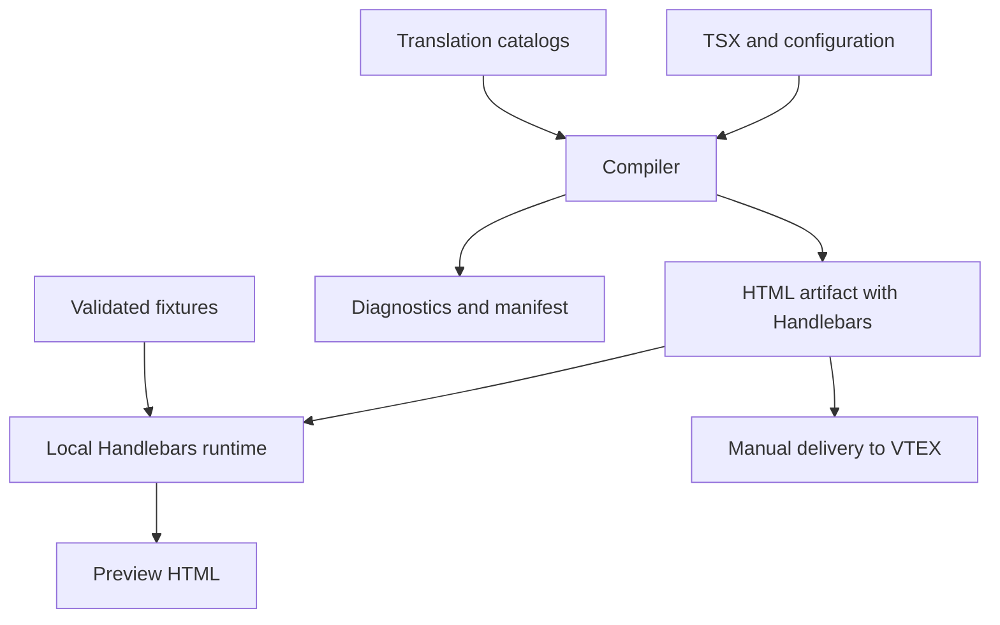

# RFC-001 — VTEX email toolchain with React Email and Tailwind CSS

| Field            | Value                                                                             |
| ---------------- | --------------------------------------------------------------------------------- |
| Status           | Proposal for implementation                                                       |
| Version          | 1.0                                                                               |
| Date             | 2026-10-01                                                                        |
| Working name     | VTEX React Email Toolchain                                                        |
| Proposed stack   | TypeScript, React, React Email, Tailwind CSS, Handlebars, Zod, pnpm               |
| Main deliverable | Email HTML/CSS containing Handlebars expressions for VTEX                         |
| Scope            | Authoring, components, internationalization, preview, validation, and compilation |
| Out of scope     | Sending email, SMTP, VTEX credentials, and automatic publishing                   |

> This RFC specifies a product to build. The names `@vtex-email/*`, commands, interfaces, and diagnostic codes are proposals; they do not represent already published packages or an official VTEX integration. Internal decisions are normative for the project. Compatibility with external services depends on the evidence and tests defined here.

## 1. Summary

Create a toolchain that allows developing VTEX transactional templates in React/TSX, composing layouts with React Email, and styling with Tailwind CSS. Compilation must produce JavaScript-independent files, with email-appropriate CSS and Handlebars preserved for evaluation by Message Center.

Order, customer, and payment data continue to be resolved by VTEX. React organizes presentation; the toolchain represents dynamic expressions without executing them during the build. Local JSONs reproduce event scenarios exclusively for validation and preview.

Preview must run the compiled artifact with Handlebars and a fixture. There will be no second React interpreter to simulate conditionals, loops, or helpers.

Internationalization generates static per-language variants and, when the target profile allows, combines those variants into a single template with runtime language selection.

## 2. Normative conventions

- **MUST / MUST NOT:** mandatory requirement for the phase in which the feature is delivered.
- **SHOULD:** recommended behavior; an exception requires a recorded technical justification.
- **MAY:** optional extension, with no commitment to implement it in the MVP.
- **Build time:** local/CI execution of the compiler.
- **VTEX runtime:** Handlebars evaluation by the platform.
- **Fixture:** sample JSON of an event, preserving its original structure.
- **Target profile:** versioned catalog of syntax, helpers, and behaviors admitted by the compiler for a VTEX target.
- **IR:** intermediate representation of expressions and blocks, used for validation and emission.

A mandatory rule must not be silently relaxed to make a template compile. Unsupported features must produce an explicit error.

## 3. Context and evidence

The [vtex-emails-multi-languages](https://github.com/patrickgratao/vtex-emails-multi-languages) project documents JSON data, helpers, translations, and per-language template combination. Its README shows locale selection with `compare` and the path `orders.0.clientPreferencesData.locale`. It is a functional reference, not a guarantee of behavior for every event or account. This proposal reuses those concepts without depending on its Gulp pipeline. [S1]

VTEX documentation describes variables originating in JSON Data, Handlebars expressions, and helpers. The official `formatCurrency` example converts `20000` to `200,00`, without a currency symbol; there are also examples of `eq` and `hasSubStr` in blocks. The documentation contains points to verify empirically, such as monetary multiplication presentation and timezone semantics. [S2]

React Email offers component rendering to HTML and Tailwind integration. The Tailwind page records Context limitations inside its wrapper and of complex selectors, and preserves media queries as non-inline CSS. The toolchain must encapsulate those version differences. [S3][S4]

### 3.1 Corrections relative to the initial design

1. Not every class is promised to be removed: selectors required by media queries must remain.
2. Turning Tailwind into CSS does not make every property compatible with every email client.
3. Juice will not be a mandatory step; it will only be enabled after need and integrity are proven.
4. A local JS helper does not install capabilities on VTEX.
5. `compare`, its operators, and the locale path are not universal assumptions.
6. Fixture validation, contract validation, and real compatibility are different outcomes.
7. Providers created by dynamic blocks inside Tailwind will not be the basis of scope control.

## 4. Problem and goals

### 4.1 Problems to solve

- Repetition of HTML, tables, styles, and Handlebars fragments across emails.
- Difficulty keeping design and translations consistent.
- Dependence on real events to visualize content variations.
- Path or helper errors that go unnoticed in development.
- Difference between what appears in preview and the template actually delivered.
- Coupling between test data and the exported HTML.

### 4.2 Verifiable goals

| ID     | Goal                             | Acceptance evidence                                         |
| ------ | -------------------------------- | ----------------------------------------------------------- |
| OBJ-01 | Write reusable layouts in TSX    | Two templates reuse layout, header, and button              |
| OBJ-02 | Preserve dynamic data            | Changing the fixture does not change build bytes            |
| OBJ-03 | Use Tailwind in development      | Supported utilities become styles, with no Tailwind runtime |
| OBJ-04 | Preview faithful to the pipeline | Preview runs the same artifact and locale selector          |
| OBJ-05 | Internationalization             | Two languages and fallback tested in the combined artifact  |
| OBJ-06 | Actionable diagnostics           | Errors identify template, rule, path, and available origin  |
| OBJ-07 | Operate without credentials      | Build, preview, and validation work offline after install   |
| OBJ-08 | Portability                      | Flow validated on Windows, Linux, and macOS                 |
| OBJ-09 | Reproducibility                  | Same inputs and versions produce identical output           |

### 4.3 Non-goals

Do not implement sending, SMTP, campaigns, a drag-and-drop visual editor, automatic Message Center sync, production order queries, asset hosting, automatic translation, general JavaScript-to-Handlebars conversion, or a promise of universal visual fidelity.

Do not create a new React Email, a custom Tailwind compiler, or a custom Handlebars language implementation.

## 5. Users and flows

### 5.1 Template developer

1. Defines an email with contract, translations, fixtures, and component.
2. Runs `vtex-email dev`.
3. Selects template and fixture; inspects content and diagnostics.
4. Adjusts components and styles with automatic updates.
5. Runs `validate` and `build`.
6. Copies the approved artifact into the matching Message Center field.

### 5.2 Reviewer

Compares representative states: multiple items, pickup, split orders, optional data, long text, and languages. Review includes generated HTML, visual differences, and the compatibility report.

### 5.3 Toolchain maintainer

Adds target capabilities with signature, evidence, simulator, and contract tests. A dependency change requires rendering and Handlebars-preservation regression.

## 6. Architecture



### 6.1 Packages

| Proposed package      | Responsibility                                                | Must not contain                            |
| --------------------- | ------------------------------------------------------------- | ------------------------------------------- |
| `@vtex-email/core`    | IR, paths, HBS emission, compilation, i18n, and diagnostics   | UI, HTTP server, or global build state      |
| `@vtex-email/react`   | `Vtex`, `Trans`, `Email` DSL and React Email/Tailwind adapter | Fixtures, sending, or order-specific rules  |
| `@vtex-email/vtex`    | Profiles, helper catalog, simulators, and sample contracts    | Automatic access to VTEX accounts           |
| `@vtex-email/cli`     | Configuration, discovery, commands, and artifact writing      | Duplicated compilation implementation       |
| `@vtex-email/preview` | Local Vite server, internal plugin, and inspection UI         | Another DSL interpreter; public Vite plugin |

Shared contracts live in core. Core receives the renderer and target profile as dependencies; it does not import the CLI or UI. The React adapter depends on core contracts, avoiding a cycle between the two. The CLI performs composition.

Modules should be small by responsibility, without imposing a class or interface on every function. Design patterns enter only when they solve a concrete need, such as per-profile emission strategy or a render adapter.

### 6.2 Technical base and versions

- pnpm monorepo; strict TypeScript; ESM modules.
- Node.js LTS supported by the chosen dependencies, pinned at the start of implementation.
- React and React Email with an explicit compatible version matrix.
- The Tailwind version must follow the tested React Email adapter; do not bump it in isolation.
- Handlebars in an isolated instance per profile/session, without global helper registration.
- Zod for contracts; validation must not silently transform the data used in preview.
- A single test runner; Vitest is the proposed choice. Playwright for UI integration when needed.
- Template TSX bundler with sourcemap support, such as esbuild, encapsulated in an adapter. The preview UI server and assets use Vite; email compilation does not go through `vite build`.
- Versioned lockfile; CI installs in frozen mode; concrete versions documented in phase P0.

## 7. Repository layout and consumer project

| Path                    | Content                                  |
| ----------------------- | ---------------------------------------- |
| `packages/core/`        | Contracts and pipeline                   |
| `packages/react/`       | Components and render integration        |
| `packages/vtex/`        | Profiles and helpers                     |
| `packages/cli/`         | Executable                               |
| `packages/preview/`     | Interface and server                     |
| `examples/basic-store/` | Runnable consumer project                |
| `tests/contracts/`      | Expected target cases                    |
| `tests/golden/`         | Regression artifacts                     |
| `docs/`                 | Guide, reference, decisions, limitations |

A consumer project contains `vtex-email.config.ts`, `emails/`, `components/`, `schemas/`, `fixtures/`, `locales/`, `assets/`, and `dist/`. Example names: `emails/order-confirmed.email.tsx`, `fixtures/order-confirmed/default.json` (or `.jsonc` with sidecar `default.meta.json`), `locales/pt-BR.json`.

`dist/` and cache are generated. Configuration files, sanitized fixtures, schemas, translations, and components are versioned. No secret file is required.

## 8. Proposed public configuration

```ts
import { defineConfig } from '@vtex-email/cli'

export default defineConfig({
  emails: ['emails/**/*.email.tsx'],
  outDir: 'dist',
  fixturesDir: 'fixtures',
  schemasDir: 'schemas',
  target: { profile: './vtex-target.json' },
  i18n: {
    locales: ['pt-BR', 'en-US', 'es-CO'],
    defaultLocale: 'pt-BR',
    catalogs: 'locales/{locale}.json',
    missingKey: 'error',
    localePath: 'locale',
  },
  tailwind: {
    preset: 'email-safe',
    theme: {
      extend: { colors: { brand: '#E1251B' } },
    },
  },
  validation: {
    unknownPath: 'error',
    unverifiedCapability: 'error',
    warningsAsErrors: false,
  },
  compatibility: {
    policy: 'conservative',
    maxSourceBytes: 250_000,
    warnRenderedBytes: 90_000,
  },
  preview: { host: '127.0.0.1', port: 3000 },
})
```

The byte limits above are the project's initial policies, not official VTEX limits or guarantees against client truncation. They must be configurable and identified as such in reports.

Configuration rules:

- Error on unknown key; no typo may be ignored.
- Paths resolved relative to the configuration directory, not the occasional cwd.
- Unique IDs restricted to characters safe for file names.
- `outDir` must not coincide with a source directory, the project root, or an ancestor of it.
- Per-email overrides (`settings`) are allowed only for documented fields; precedence is settings → project → file convention.
- `schemasDir` (default `schemas`) associates `{schemasDir}/{fileKey}.ts` with Zod `export default` to the file key (basename without `.email.tsx`).
- `i18n.localePath` on the project is the default; if absent on both project and email, resolution fails with a diagnostic.
- TypeScript configuration is trusted local code, not a safe format for executing third-party projects.

## 9. Email definition

The default export is the React component. Optional overrides live in `export const settings`.

```tsx
import type { EmailSettings } from '@vtex-email/core'
import { Email, Trans, Vtex } from '@vtex-email/react'

export const settings = {
  i18n: {
    localePath: 'orders.0.clientPreferencesData.locale',
    output: 'merged',
    aliases: { 'pt-br': 'pt-BR' },
  },
} satisfies EmailSettings

export default function OrderConfirmed() {
  return <Email className="m-0 bg-white font-sans">{/* … */}</Email>
}
```

Minimal example (when project `{schemasDir}/{fileKey}.ts` and `localePath` suffice):

```tsx
import { Email, Trans, Vtex } from '@vtex-email/react'

export default function AuthCode() {
  return <Email className="m-0 bg-white font-sans">{/* … */}</Email>
}
```

For `auth-code.email.tsx`, the key is `auth-code`: default `id`/`event`, fixtures under `{fixturesDir}/auth-code/`, schema at `{schemasDir}/auth-code.ts` (`export default`). Overriding `id` or `event` in `settings` does not change the fixtures folder or the schema file.

`event` is local metadata, not an identifier automatically registered with VTEX. The schema and `localePath` must match the chosen event JSON. It is not assumed that every event contains `orders`.

The component does not receive the fixture JSON as props. It may receive approved static configuration — theme, brand, and composition parameters — but not locally resolved order data.

Fixtures accept `.json` (strict) and `.jsonc` (comments and trailing commas). Both require the `{id}.meta.json` sidecar. Collision between `default.json` and `default.jsonc` is an error.

A subject may be defined as a separate textual expression in a later phase. The HTML body must never be reused as the subject. Helper support in that field requires its own target verification.

## 10. React DSL for dynamic data

### 10.1 Full authoring example

```tsx
import { Email, Heading, Section, Text, Vtex, Trans, expr } from '@vtex-email/react'

export function OrderConfirmed() {
  return (
    <Email className="m-0 bg-gray-100 font-sans">
      <Section className="mx-auto w-full max-w-[600px] bg-white p-6">
        <Heading className="m-0 text-2xl font-bold text-brand">
          <Trans id="order.confirmed.title" />
        </Heading>

        <Vtex.Each path="orders">
          <Text>
            <Trans id="common.hello" /> <Vtex.Value path="clientProfileData.firstName" />
          </Text>
          <Text>
            <Trans id="order.number" /> <Vtex.Value path="orderId" />
          </Text>

          <Vtex.Each path="items">
            <Text className="text-sm text-gray-700">
              <Vtex.Value path="quantity" />
              {' × '}
              <Vtex.Value path="name" />
            </Text>
            <Text>
              R$ <Vtex.Helper name="formatCurrency" args={[expr.path('sellingPrice')]} />
            </Text>
          </Vtex.Each>

          <Vtex.If path="shippingData.address">
            <Text>
              <Vtex.Value path="shippingData.address.street" />
            </Text>
          </Vtex.If>
        </Vtex.Each>
      </Section>
    </Email>
  )
}
```

The `R$` symbol is a decision of this store example, not a locale effect. A multi-currency store must make the currency policy supported by the event explicit; changing language does not convert values.

### 10.2 Components and semantics

| API                                | Conceptual emission               | Contract                                     |
| ---------------------------------- | --------------------------------- | -------------------------------------------- |
| `Vtex.Value path="orderId"`        | `{{orderId}}`                     | Value with Handlebars escaping               |
| `Vtex.Each path="items"`           | `{{#each items}}…{{/each}}`       | Dynamic iteration; changes context           |
| `Vtex.If path="address"`           | `{{#if address}}…{{/if}}`         | Handlebars profile truthiness                |
| `Vtex.Unless path="address"`       | `{{#unless address}}…{{/unless}}` | Negation of the test                         |
| `Vtex.With path="address"`         | `{{#with address}}…{{/with}}`     | Nested context; later phase                  |
| `Vtex.Helper name args`            | `{{helper arg1 arg2}}`            | Inline helper registered in the profile      |
| `Vtex.BlockHelper name args`       | `{{#helper args}}…{{/helper}}`    | Block helper with declared semantics         |
| `Vtex.Compare left operator right` | Profile emitter                   | Comparison only if the capability is enabled |
| `Trans id values`                  | Catalog text + expressions        | Static translation per variant               |

All blocks accept `fallback?: ReactNode`, representing `{{else}}`. `Vtex.Each` in the MVP accepts arrays; object iteration is outside the initial contract. `Vtex.FormatCurrency path` may be a transparent shortcut to `Vtex.Helper`, with no additional logic.

Examples:

```tsx
<Vtex.If path="shippingData.address" fallback={<Text>Pickup</Text>}>
  <Address />
</Vtex.If>

<Vtex.Compare
  left={expr.path('split')}
  operator="!="
  right={expr.literal(true)}
>
  <Payment />
</Vtex.Compare>

<Vtex.Helper
  name="replace"
  args={[
    expr.path('shippingEstimate'),
    expr.literal('bd'),
    expr.literal(' business days'),
  ]}
/>
```

The comparison API uses explicit operands to avoid ambiguity between path and string literal. Unknown or unverified operators for the profile cause an error; they must not be replaced by a JavaScript approximation.

### 10.3 Scope rules

- Paths are relative to the current context.
- `each` and `with` create the context described by the profile; `if` and `unless` preserve context.
- `../`, `@root`, `this`, indexes, and variables such as `@index`/`@first`/`@last` are released only with profile support and tests.
- Initially support common properties, numeric indexes, and `../`; special segment syntaxes must be explicitly documented.
- The parser accepts a deliberate path subset, not any interpolated string.
- `orders.0.items` may be normalized to the syntax accepted by the target; the transformation must be tested.
- Scope of `each` `fallback` must not assume a nonexistent item. Its resolution must follow the selected Handlebars runtime.
- Helper blocks declare whether they preserve or change context. Without that declaration, their compilation is rejected.
- Analysis uses the final nested IR structure; it does not depend on a global counter or React Context created inside Tailwind.

In documented Handlebars, the `if` test treats `0`, empty string, and empty array as false. The toolchain must not replace that with JavaScript `Boolean(value)`. [S5]

### 10.4 Dynamic attributes

Use explicit wrappers so expression objects are not accidentally converted to strings by React components:

```tsx
<Vtex.Link href={expr.path('orderUrl')}>
  <Trans id="order.view" />
</Vtex.Link>

<Vtex.Button href={expr.path('orderUrl')} className="bg-brand px-6 py-3">
  <Trans id="order.view" />
</Vtex.Button>

<Vtex.Img
  src={expr.path('imageUrl')}
  alt={expr.path('name')}
  width={96}
  height={96}
/>
```

Wrappers accept a static string or typed expression for the documented attributes. An ordinary string is always literal; `href="orderUrl"` does not mean a path. References must be passed with `expr.path`.

MVP: `href`, `src`, `alt`, and `title`. Do not support dynamic expressions in tag name, attribute name, `className`, CSS, or `style`.

URL concatenation may be a later extension, but HTML escaping is not URL encoding. Values used in segments or query strings must already be correctly encoded or depend on a verified target capability; do not invent an encoding helper.

### 10.5 Logic allowed in React

Allowed: composition, constants, theme tokens, static props, and `.map()` over static navigation/content lists.

Forbidden: importing a fixture into the template, using order data in `if`, ternary, or `.map()`, calling the network, reading the clock, or generating randomness during render.

The toolchain must block fixture and preview-library imports in the template graph, and provide lint for obvious non-determinism sources. It does not promise to prove purity of every arbitrary TypeScript program. Fixture invariance tests complement static analysis.

## 11. Compiler and intermediate representation

### 11.1 Central contracts

```ts
type Expression =
  | { kind: 'path'; value: string }
  | { kind: 'literal'; value: string | number | boolean | null }
  | { kind: 'helper'; name: string; args: Expression[] }

interface Diagnostic {
  code: string
  severity: 'error' | 'warning' | 'info'
  message: string
  templateId?: string
  locale?: string
  fixtureId?: string
  source?: { file: string; line?: number; column?: number }
  path?: string
  suggestion?: string
}

interface CompileResult {
  artifacts: Array<{
    name: string
    content: string
    sha256: string
  }>
  diagnostics: Diagnostic[]
  manifest: BuildManifest
}
```

Nested helper expressions are accepted only when the target supports subexpressions. Existence of a type in the IR does not automatically enable its emission.

### 11.2 Mandatory sequence

1. Load and validate configuration, modules, dependencies, and profile.
2. Discover emails and detect duplicate IDs.
3. Validate catalogs and resolve language variants.
4. Create an isolated compilation context per email and locale.
5. Render React Email/Tailwind, transporting dynamic operations as opaque markers.
6. Process CSS/HTML only in the approved steps that preserve those markers.
7. Rebuild the IR from markers; validate nesting, paths, helpers, and attribute contexts.
8. Emit Handlebars with safe serialization of paths and arguments.
9. Validate HBS syntax and profile capabilities.
10. Combine language variants when requested.
11. Validate fixtures and run the preview matrix using the resulting artifact.
12. Write artifacts and manifest atomically only if build requirements are satisfied.

No optimizer that interprets HTML may process the template after Handlebars restoration without an explicit preservation test. The HBS parser, textual inspection, and hash calculation remain allowed.

### 11.3 Marker strategy

Initially adopt opaque markers associated with typed descriptors. A value need not emit `{{orderId}}` during React; it may emit an internal identifier restored after rendering.

Requirements:

- Reserved namespace; collisions with project text cause an error.
- Deterministic identity based on descriptor and origin when available; no random UUID in the artifact.
- Registry isolated per compilation, without a mutable global variable shared across renders.
- Open, alternative, and close markers form a balanced sequence.
- Repetitions introduced by the renderer must be recognized and validated by context, including Outlook conditional HTML; do not apply the naive one-occurrence-per-expression rule.
- Do not interpret external strings as executable descriptors.
- No marker may remain in `dist`.
- Error if a marker is truncated, moved to an invalid context, or restored in a forbidden attribute.
- Do not decode HTML entities globally to recover expressions; restoration must act only on recognized tokens.

**The strategy is a technical hypothesis subject to the P0 gate.** Sentinel text between table elements may be moved by HTML parsers. The proof must cover that situation before enabling inlining, minification, or DOM normalization. If there is no reliable transport, replace the mechanism with custom structural lowering before rendering; do not patch the HTML with generic regex.

### 11.4 React and Tailwind integration

`Email` centralizes `Html`, `Head`, `Body`, Tailwind, and visual configuration. Providers required by the compilation environment sit above the Tailwind wrapper. DSL blocks do not create nested providers to simulate dynamic scope.

The adapter must prove that translations, custom components, and internal classes are processed by the chosen version. If it uses an asynchronous server context for token emission, it must be local to the execution, reentrant, and tested with concurrent compilation. It is not application-global state.

Source locations must come from TSX load/transform or sourcemaps. When the exact location is unavailable, report file, template, and expression identifier; never invent line/column.

## 12. Tailwind, CSS, and email HTML

### 12.1 Style policy

| Category                                        | Initial policy                                                         |
| ----------------------------------------------- | ---------------------------------------------------------------------- |
| Colors, typography, spacing, simple borders     | Compile and validate emitted CSS                                       |
| Widths, tables, alignment                       | Prefer email components and fallbacks                                  |
| Responsiveness                                  | Preserve rules in `style` and required classes                         |
| `flex`, `grid`, positioning, and transforms     | Diagnose per client matrix; avoid in the conservative preset           |
| `hover`, compound selectors, `space-*`, `prose` | Require demonstrated adapter and target-client support                 |
| CSS variables and modern color formats          | Resolve when possible; warn/error if the profile does not support them |
| Classes derived from the payload                | Reject in the MVP                                                      |

The `email-safe` preset is a project policy, not a certification. It should favor px units, explicit colors, and layouts with `Section`, `Row`, and `Column`. Real Tailwind options stay encapsulated by the adapter, without promising that any arbitrary `tailwind.config` will work.

Lint must also inspect inline CSS and `<style>`, because a template can introduce incompatible properties without using Tailwind classes.

### 12.2 Responsiveness

The template must have a base layout readable without media queries. Responsive styles are progressive enhancement. `<Head>` must be emitted correctly to receive the required rules.

Do not remove classes referenced by preserved CSS, MSO conditional comments, or attributes required by the renderer. Do not treat `border-radius`, external fonts, or visual effects as essential to understanding the content.

### 12.3 Additional inlining

Disabled by default. React Email/Tailwind is responsible for the main transformation. An optional Juice adapter may serve legacy CSS, provided it preserves queries, conditional rules, precedence, and markers.

It is mandatory to compare the result with and without the step to ensure it does not destroy expressions, reorder blocks, or alter styles improperly. Double inlining must not occur by accident.

### 12.4 Compatibility and accessibility

Initial manual validation matrix: Gmail web/mobile, Apple Mail/iOS, Outlook web, and classic Outlook on Windows, with versions and dates recorded in the report. A Chromium view does not replace that check.

Require `alt` on informative images, comprehensible link text, coherent reading order, document language, adequate contrast, and layout tables with appropriate semantics when supported. The linter must indicate which checks are automated and which depend on review.

Do not emit a generic “compatibility guaranteed” message. Report verified rules, warnings, and real evidence per client.

## 13. Internationalization

### 13.1 Catalogs

UTF-8 JSON with stable keys. In the MVP, use flat keys and textual messages:

```json
{
  "order.confirmed.title": "Order confirmed",
  "order.number": "Order",
  "common.hello": "Hello",
  "order.view": "View order",
  "order.greeting": "Hello, {firstName}!"
}
```

Typed interpolation:

```tsx
<Trans id="order.greeting" values={{ firstName: expr.path('clientProfileData.firstName') }} />
```

The message parser distinguishes text and placeholders. Text goes through React escaping; dynamic expressions go through the token/HBS pipeline. There is no unsafe HTML concatenation.

### 13.2 Mandatory rules

- Missing key in an enabled language: build error by default.
- Placeholders must match across languages; missing/extra are errors.
- Translation does not accept arbitrary HTML, HBS expressions, or `{{`/`}}` delimiters in the MVP.
- Rich messages with components and dynamic pluralization are for a later phase.
- Language fallback must not hide a missing translation key.
- Date, number, and currency are not automatically internationalized just because the catalog changes.
- Catalogs and their resolution order enter the build fingerprint.

### 13.3 Locale selection

Each event configures its path. Missing, null, empty, or unknown locale falls to `defaultLocale`. The default must appear in the language list. Aliases, such as `pt-br` → `pt-BR`, must be declared and compiled into explicit branches; do not normalize only in preview.

The selector uses an equality capability enabled in the profile. If `compare` is not verified, it must not be emitted just because it exists in the reference project. A profile may use `eq` if its contract has been established.

### 13.4 Merge strategy

MVP: each branch contains a complete document and is mutually exclusive. The combined HBS template may contain several documents as source; after evaluation, it must result in exactly one doctype, one `html`, one `head`, and one `body`.

Conceptual example, conditioned on a profile with validated `eq`:

```handlebars
{{#eq orders.[0].clientPreferencesData.locale 'en-US'}}
  <html lang='en-US'>…</html>
{{else}}
  <html lang='pt-BR'>…</html>
{{/eq}}
```

Do not insert complete documents inside another document's `body`. Do not analyze the combined source as if it were already a delivered email's HTML. HTML structure checks operate after resolving each branch with fixtures.

This strategy increases source size, but avoids merging heads/CSS prematurely. It must be homologated in Message Center in P0/P2. If the target does not accept the format, deliver separate variants until a single-shell strategy is approved; do not silently change semantics.

### 13.5 Output modes and preview

- `per-locale`: one file per language, without automatic selection.
- `merged`: one artifact for VTEX and auxiliary variants identified in the manifest.
- “Runtime” preview: uses the locale contained in the fixture and the combined artifact; this is the default mode.
- “Force locale” preview: clones the fixture, replaces only the configured path, and goes through the same selector; shows that change in the UI and does not modify the file.
- An isolated variant view must be identified as such and does not count as a selector test.

## 14. Helpers and VTEX profiles

### 14.1 Capability catalog

Each helper must register emission name, inline/block type, arity, admitted types, context rules, output escaping, local simulator, evidence, and known limitations.

Evidence classification:

| State          | Meaning                                                          |
| -------------- | ---------------------------------------------------------------- |
| `documented`   | Appears in an official source, but may have untested details     |
| `verified`     | There is execution evidence on the target for the declared cases |
| `experimental` | Only indirect reference or incomplete semantics                  |

These states are not equivalent to universal approval. The profile relates each capability to the relevant evidence. The local Handlebars version must not be announced as VTEX's internal version without confirmation.

### 14.2 Initial scope

Prioritize `each`, `if`, `unless`, escaped interpolation, and `formatCurrency`. Add equality for i18n, `replace`, dates, `hasSubStr`, and comparison operators according to verified contracts.

For `formatCurrency`, test zero, integer cents value, negative, magnitude limit, numeric string, and absence. Values not covered by the contract must produce a diagnostic, not a silent approximation. Do not convert cents in React before applying the helper.

Dates require explicit decisions about input format and timezone. The simulator must never depend on the machine timezone. When real behavior is not established, show the limitation and prevent an equivalence claim.

### 14.3 Extensions

A custom helper may locally simulate an already proven target capability. Registering a JS function does not make it usable on VTEX. Local-only helpers must not appear in artifacts destined for the platform.

If a value must be transformed exclusively at build time, it must be static. Transformations over event data must be expressed in real target capabilities or excluded from scope.

`build` refuses unknown capabilities. An explicit development option may allow experimental capabilities, marking the manifest as not homologated; that option does not satisfy production release criteria.

## 15. Fixtures, schemas, and path validation

### 15.1 Data contracts

Each event must have a schema representative of the consumed fields. Unknown fields must be preserved, using the passthrough/loose object equivalent of the chosen Zod version.

Conceptual example:

```ts
const ItemSchema = z
  .object({
    name: z.string(),
    quantity: z.number().int(),
    sellingPrice: z.number().int(),
  })
  .passthrough()

const OrderConfirmedSchema = z
  .object({
    orders: z.array(
      z
        .object({
          orderId: z.string(),
          clientProfileData: z
            .object({
              firstName: z.string().optional(),
            })
            .passthrough(),
          items: z.array(ItemSchema),
        })
        .passthrough(),
    ),
  })
  .passthrough()
```

The example is partial; the contract used by the full template must also describe address and locale preferences. Do not assume `.passthrough()` makes every unknown path correct.

Schema transforms, coercions, and defaults must not alter the fixture before preview. Validate without mutating and render the original data. If a future feature offers normalization, it must be separate and identified as a divergence from the real payload.

### 15.2 Fixture origin

Prefer JSON Data from the intended event, sanitized, or a synthetic fixture with the same format. Order API data may help compose the example, but does not replace confirmation of the event envelope.

Each scenario must have metadata external to the payload: description, origin, event, purpose, and expected locale/branch outcome. Do not add development metadata to the JSON sent to the interpreter as if they were VTEX fields.

### 15.3 Minimum matrix

| Scenario                                | Risk covered                  |
| --------------------------------------- | ----------------------------- |
| Simple order                            | Base flow                     |
| Multiple items                          | Iteration                     |
| More than one order/seller              | Nested contexts               |
| Missing address / pickup                | Conditional and optionality   |
| Empty array                             | Fallback without item context |
| Long text and special characters        | Layout and escaping           |
| Known, missing, and unknown locale      | Selector and fallback         |
| Zero and representative monetary values | Helper contract               |
| Invalid data                            | Negative diagnostics          |

Negative fixtures live in a separate set, with an expected failure result; they must not make the normal build permanently invalid.

### 15.4 Three validation levels

1. **Schema:** does the payload respect the event contract?
2. **References:** are paths and arguments compatible with schema and scope?
3. **Execution:** does the artifact work in the declared scenarios, without unexpected results?

A missing optional field is not automatically a typo. If the schema declares it optional and usage is guarded, absence may be valid. A path nonexistent in the contract is an error, even if the schema preserves other fields.

An empty array neither proves nor invalidates the item structure. Use the schema for that structure and record lack of concrete coverage. Unions require per-variant analysis; do not declare impossibility only because a field does not appear in all.

Complex schemas the analyzer cannot inspect must produce `PATH_UNANALYZABLE`, with the possibility of an explicit path contract. Do not silently depend on unstable Zod internals.

### 15.5 Typing limits

The MVP offers typed props and expressions, but paths may remain strings validated by the compiler. Schema-derived path autocomplete is a later evolution. Do not sell complete nested-scope typing before implementing and testing it.

## 16. Local preview

The interface must present an email list, fixture selector, runtime/forced locale, desktop/mobile viewport, rendered HTML, HBS template, diagnostics, and scenario metadata.

Requirements:

- Watch of templates, components, configuration, schemas, and translations, coordinated by the preview Vite server.
- Changing only a fixture must re-run validation/rendering, without unnecessarily recompiling the TSX.
- Changing only the Zod schema must revalidate paths and fixtures, without recompiling the template.
- Invalidation by real dependency; a shared component change updates all affected consumers.
- Compile changes with debounce and discard obsolete results from a previous run.
- If the build fails, keep the last valid preview with a visible stale warning.
- Show local helper errors and profile limitations.
- Use an isolated iframe; email does not run scripts and links do not navigate the preview application.
- Local bind by default; network exposure requires an explicit option.
- Export resolved preview only by explicit command, in a directory different from `dist`.

“Mobile” means viewport width, not faithful emulation of an email app. Remote images may make requests when viewing; offer a mode that blocks them. The compiler must not fetch them during the build.

## 17. CLI

| Command                                                               | Result                                                     |
| --------------------------------------------------------------------- | ---------------------------------------------------------- |
| `vtex-email dev`                                                      | Preview server with watch                                  |
| `vtex-email build`                                                    | Compiles all emails                                        |
| `vtex-email build order-confirmed`                                    | Compiles only the selected ID                              |
| `vtex-email validate`                                                 | Checks contracts, expressions, translations, CSS, fixtures |
| `vtex-email validate --format json`                                   | Structured diagnostics for CI                              |
| `vtex-email preview order-confirmed --fixture default --out preview/` | Exports resolved HTML for a scenario                       |

Common options: `--config`, `--format`, `--warnings-as-errors`. `build --locale pt-BR` must produce an identified isolated variant, never silently overwrite the combined template.

`validate` may run compilation in memory; it does not write production artifacts. `build` must run the required gates even if `validate` was not called beforehand. Do not provide a generic flag that ignores structural errors.

Exit codes: `0` success; `1` validation/compilation failure; `2` invalid usage/configuration. Human logs on stderr when stdout contains JSON. No colors when there is no TTY or when disabled. Versioned and stable JSON result.

There are no `send`, `deploy`, or `sync` commands in scope.

## 18. Artifacts and manifest

| Artifact                                  | Use                                                   |
| ----------------------------------------- | ----------------------------------------------------- |
| `dist/order-confirmed.html`               | Combined HTML + HBS template, when configured         |
| `dist/locales/pt-BR/order-confirmed.html` | Language variant                                      |
| `dist/manifest.json`                      | Build inventory and metadata                          |
| `dist/diagnostics.json`                   | Diagnostics, if requested                             |
| `preview/order-confirmed.default.html`    | Resolved content; never publish as a dynamic template |

Mandatory manifest: format version, compiler/adapters/profile, template/event, locales, output files, SHA-256 hashes, capabilities used, homologation state, and pertinent warnings. Do not include fixture contents, credentials, or absolute machine paths.

Timestamps do not enter deterministic artifacts. If desired, they live in an external log. The template hash depends on sources, theme, catalog, configuration, and compilation versions; not on which fixture is selected in preview. Validation reports may reflect fixture changes.

Writing must occur in a temporary directory and be promoted after success. A partial build only replaces artifacts of the selected email and updates its inventory; it does not delete outputs of other emails. Cleanup only removes files identified as generated by the toolchain.

## 19. Security, escaping, and trust boundaries

### 19.1 Code and content

Templates/configuration are trusted local code. The tool is not a sandbox for third-party TSX. Fixtures are data, with no function or JavaScript execution. Limit size, depth, and item count to avoid accidental hangs in preview.

### 19.2 Escaping

- Dynamic interpolation uses `{{value}}` by default.
- Triple braces, indiscriminate `SafeString`, and `dangerouslySetInnerHTML` with dynamic data are forbidden in the MVP.
- Paths and helper names are analyzed, not concatenated without validation.
- Literals are serialized with HBS language rules; quotes, slashes, and special characters have dedicated tests.
- Static text and translation with HBS delimiters must be rejected in the MVP to avoid accidental interpretation in the final step.
- Reject access to `__proto__`, `prototype`, and `constructor` in the DSL; local runtime without prototype access.
- Do not re-execute HBS that appears inside a fixture value; the runtime has a single evaluation.

### 19.3 URLs and assets

Static URLs must use allowed schemes; initially HTTPS, with `mailto:` and `tel:` where applicable. `javascript:`, `data:`, and executable content are rejected in the conservative profile.

For dynamic URLs, the compiler checks fixtures and documents the expected origin, but cannot guarantee future content received by VTEX. HTML escaping does not validate URL scheme. That limitation must appear in the component contract.

Production assets must have a definitive public URL. Local paths are allowed in preview, but block a production build without explicit mapping. The toolchain does not upload images.

### 19.4 Personal data

Sample fixtures must contain fictional names, emails, phones, documents, addresses, and tokens. Logs and diagnostics show paths and types, avoiding dumping a full payload. Exported preview must not enter `dist` or be versioned by default.

## 20. Diagnostics

| Code                | Default severity | Situation                                               |
| ------------------- | ---------------- | ------------------------------------------------------- |
| `CFG001`            | Error            | Invalid configuration                                   |
| `DSL001`            | Error            | Fixture imported by the template                        |
| `DSL002`            | Error            | Expression in unsupported context                       |
| `HBS001`            | Error            | Invalid syntax or blocks                                |
| `HBS002`            | Error            | Helper/capability not enabled                           |
| `TOK001`            | Error            | Token lost, corrupted, or not restored                  |
| `DATA001`           | Error            | Fixture does not meet schema                            |
| `PATH001`           | Error            | Path nonexistent in contract/scope                      |
| `PATH002`           | Warning          | Optional path without sufficient coverage or guard      |
| `PATH_UNANALYZABLE` | Error            | Contract not inspectable without additional description |
| `I18N001`           | Error            | Missing or inconsistent translation/placeholder         |
| `CSS001`            | Warning          | Property with limited support in the profile            |
| `CSS002`            | Error            | Utility not processed by the adapter                    |
| `HTML001`           | Error            | Resolved document structurally invalid                  |
| `ASSET001`          | Error            | Local reference in production output                    |
| `SIZE001`           | Warning/error    | Configured byte limit exceeded                          |
| `TARGET001`         | Warning/error    | Experimental capability or insufficient evidence        |

Human example:

```text
PATH001 order-confirmed / pt-BR
emails/order-confirmed.email.tsx:42:9
Path "sellingPrce" does not exist in context orders[].items[].
Suggestion: check "sellingPrice".
```

Warnings must be promotable to error in CI. Suppressions require code, scope, and justification; token integrity, syntax, context security, and unknown-helper errors are not suppressible.

## 21. Tests and quality criteria

### 21.1 Unit

Path parser, scope resolution, literal serialization, block structure, i18n, fallback, helper catalog, CSS policies, and fingerprint calculation.

### 21.2 Compiler integration

Mandatory cases:

1. Nested `each` in table layout, with fallback and relative fields.
2. `if` inside `each`, preserving context.
3. Use of `../` and indexes in the enabled subset.
4. Dynamic `href`, `src`, `alt`, and characters `&`, quotes, and Unicode.
5. React Email button and Outlook conditional fragments.
6. Translations with dynamic placeholders.
7. Preserved responsive CSS, required classes, and inline styles.
8. Helpers with multiple arguments and distinct types.
9. Simultaneous compilations without locale or token leakage.
10. Two different fixtures producing the same template and different previews.
11. Fixture containing Handlebars-like text, without a second evaluation.
12. Missing/corrupted tokens leading to failure, without partial output generation.
13. Each merge language producing a complete and unique document.
14. Unknown and missing locale using the same fallback in preview and artifact.

Golden tests must be accompanied by semantic assertions: a snapshot change must not hide removed HBS, frozen data, or new helpers. HTML validation happens over runtime results, not over still-open HBS blocks.

### 21.3 Target contracts

Keep minimum cases of input, template, expected result, source, date, and verification environment, without personal data. Manual evidence is accepted; automation against VTEX is not an MVP requirement.

Homologate the generated HTML in Message Center, language merge, escaping, helpers, and context behavior. If there is no access to a VTEX environment, deliver the toolchain as experimental and record the pending gate, without declaring confirmed parity.

### 21.4 Visual tests

Local regression with screenshots of representative fixtures. Review in real clients for reference layouts. These tests do not demonstrate helper execution equivalence, which requires the previous contracts.

### 21.5 CI

Frozen install → typecheck/lint → unit and integration tests → example builds → artifact validation. OS matrix at least for CLI and deterministic build; visual jobs may be concentrated in one pinned environment.

Dependencies must be updated in reviewable changes. No React Email/Tailwind/Handlebars version is updated without running the token, table, style, and i18n cases.

## 22. Local performance and operation

Initial experience targets, measured on a recorded reference machine: rebuild of a small email in up to 2 seconds and fixture change in up to 500 ms after warm-up. These are engineering targets, not prior promises.

Cache includes transitive dependencies, configuration, catalogs, profile, and versions. Compiled HTML cache is separate from preview cache, which includes the fixture hash.

Limit concurrency to avoid memory pressure. Each compilation must be cancelable/discardable in watch mode. A release build does not depend on cache to work correctly.

No command requires a specific shell: Node scripts and filesystem APIs replace PowerShell/Bash-only commands. Normalize output encoding and line breaks to UTF-8/LF; test file names with spaces and Windows paths.

## 23. Deliveries by phase

| Phase             | Deliveries                                                                                             | Exit gate                                                       |
| ----------------- | ------------------------------------------------------------------------------------------------------ | --------------------------------------------------------------- |
| P0 — Feasibility  | Initial versioning, tokens + Tailwind + tables + attributes proof; merge trial; minimum target catalog | Do not lose or move operations; record limitations and evidence |
| P1 — Core         | IR, `Value/Each/If/Unless/Helper`, attributes, deterministic build, and one language                   | Dynamic confirmation email, without embedded fixture            |
| P2 — MVP product  | I18n/merge, schemas/paths, preview, CLI, diagnostics, representative fixtures                          | Scenario matrix approved; external gates made explicit          |
| P3 — Homologation | VTEX tests, required comparison/equality and helpers verified; client tests                            | MVP fit for use on the homologated target                       |
| P4 — Expansion    | More events, `With`, rich messages, subjects, autocomplete, and style extensions                       | Per-feature RFCs/ADRs                                           |

The usable MVP gathers P0 through P3. Experimental versions may be tested and distributed before P3, identified as such. The initial focus is order confirmation; a second email, such as cancellation, proves reuse and payload differences before API stabilization.

### 23.1 Implementable backlog

| ID  | Task                                | Expected result                                 | Dependency    |
| --- | ----------------------------------- | ----------------------------------------------- | ------------- |
| T01 | Create workspace and version matrix | Packages compile and tests run                  | —             |
| T02 | Prove token transport               | Technical table/attribute/CSS fixtures approved | T01           |
| T03 | Define minimum profile and contract | Helpers and syntax documented, gaps visible     | T01           |
| T04 | Implement IR and HBS serializer     | Safe emission and diagnostics                   | T02, T03      |
| T05 | Implement DSL and React adapter     | First template compiles                         | T04           |
| T06 | Implement styles and CSS policies   | Inline + responsive Tailwind validated          | T05           |
| T07 | Implement local runtime             | Artifact renders against fixtures               | T04           |
| T08 | Implement schemas and scopes        | Nested and optional paths analyzed              | T05, T07      |
| T09 | Implement catalogs and merge        | Selector/fallback executed in the artifact      | T03, T06, T07 |
| T10 | Implement CLI and atomic outputs    | Build/validate/preview usable in CI             | T08, T09      |
| T11 | Implement preview UI                | Watch, scenarios, and diagnostics               | T10           |
| T12 | Create two examples and docs        | Reproducible onboarding                         | T11           |
| T13 | Homologate target and clients       | Evidence and limitation matrix                  | T12           |
| T14 | Prepare distribution                | Packages tested in a clean project              | T13           |

## 24. MVP Definition of Done

- [ ] A new project can install, develop, validate, and compile following the documentation.
- [ ] Build does not require an account, credential, or network call.
- [ ] Two emails share presentation components.
- [ ] Order confirmation covers multiple orders/items, optional fields, and special data.
- [ ] Two languages, runtime selection, and fallback pass in the same pipeline.
- [ ] Static CSS is resolved; required responsive rules are preserved.
- [ ] Build contains no application JavaScript, fixtures, internal tokens, or disabled helper.
- [ ] Swapping the fixture does not alter the production artifact.
- [ ] Invalid schema, wrong path, missing translation, and broken blocks produce useful errors.
- [ ] Output is deterministic and writing leaves no partial artifact on failure.
- [ ] Windows, Linux, and macOS pass the declared CLI flows.
- [ ] Helper and client matrix states what was actually tested.
- [ ] P3 VTEX homologation is complete for the release marked as compatible.
- [ ] No send or publish operation was introduced.

## 25. Decisions and alternatives

| Topic        | Decision                     | Alternative not adopted now         | Reason                                     |
| ------------ | ---------------------------- | ----------------------------------- | ------------------------------------------ |
| Preview      | Execute final HBS            | Interpret the DSL twice             | Avoid divergent semantics                  |
| Dynamic data | Explicit DSL                 | Compile arbitrary JS                | Scope and predictability                   |
| Styles       | React Email/Tailwind adapter | Implement email CSS from scratch    | Concentrate effort on VTEX integration     |
| Inlining     | Optional                     | Mandatory Juice                     | Avoid redundant transform and block damage |
| I18n         | Full variants and branches   | Initial structural deduplication    | Simplify correction                        |
| Helpers      | Per-target catalog           | Accept any local helper             | Do not emit nonexistent capabilities       |
| Typing       | Path validation + TS props   | Full inference in the first release | Avoid blocking the MVP                     |
| Publishing   | Manual export                | Deploy integration                  | Keep scope without credentials             |

## 26. Risks and mitigation

| Risk                                               | Mitigation                                               | Blocks release?                   |
| -------------------------------------------------- | -------------------------------------------------------- | --------------------------------- |
| Markers moved by HTML normalization                | P0; avoid unsafe reparse; structural lowering if needed  | Yes                               |
| Incompatible Context/Tailwind or custom components | Environment outside the wrapper; version tests           | Yes                               |
| Local helper different from the real one           | Target contracts and evidence classification             | Yes for used capability           |
| Event payload different from the fixture           | Per-event contract and sanitized real examples           | Yes when it blocks the main case  |
| Large multilingual source                          | Measure bytes; separate variants as an explicit mode     | Per configured limit              |
| Layout differs in Outlook                          | Conservative components and real test                    | Per severity on the target client |
| Complex schema prevents analysis                   | Explicit path contract; clear error                      | Yes for unverifiable paths        |
| Excessive lint promise                             | Report separates heuristic, local test, and homologation | Yes for compatibility claims      |

## 27. Pending items with owner and resolution condition

| Pending item                                      | Functional owner        | Resolve by                          |
| ------------------------------------------------- | ----------------------- | ----------------------------------- |
| Definitive name and package availability          | Project maintainer      | Before npm publication              |
| Exact React/React Email/Tailwind/Node versions    | Adapter owner           | P0                                  |
| Stable block transport in tables                  | Compiler owner          | P0                                  |
| Merge format accepted on the target               | VTEX homologation owner | Technical P0; confirmation by P3    |
| Operators and helpers required by the first event | VTEX profile owner      | P1/P3                               |
| Date/timezone semantics                           | VTEX profile owner      | Before releasing each helper        |
| Envelope and locale of the reference event        | Template owner          | P1                                  |
| Project license and right to reuse external files | Project maintainer      | Before copying/distributing content |

Until licenses and rights are confirmed, use the reference repository as inspiration and create own synthetic fixtures. This RFC does not authorize assuming a license from the code being public.

Pending items do not allow improvising production behavior. A decision that changes the pipeline, public API, or preview semantics must be recorded in an ADR and reflected in tests and this RFC.

## 28. Rules for AI-assisted implementation

1. Implement in gate order, starting with the compiler proof, before investing in the UI.
2. Read this RFC and the repository instructions before changing code.
3. Do not add sending, credentials, external integrations, or deploy.
4. Do not use mocks to declare that VTEX supports a helper.
5. Do not import a fixture into the component or pre-render loops of event data.
6. Do not remove HBS, media queries, or MSO comments to make tests pass.
7. Do not implement a future feature without need from the current milestone.
8. Do not create generic abstractions without at least one concrete use or defined external boundary.
9. Update examples and reference when the API changes.
10. Close each phase with evidence of acceptance criteria, limitations, and next gates.

## 29. Sources consulted

Consulted on 2026-10-01. References document external behaviors; the requirements and architecture of this RFC are original proposals.

- **[S1] Reference repository:** [patrickgratao/vtex-emails-multi-languages](https://github.com/patrickgratao/vtex-emails-multi-languages). README, organization, and merge example.
- **[S2] VTEX:** [How to set up functions in the Message Center templates](https://developers.vtex.com/docs/guides/how-to-set-up-functions-in-the-message-center-templates). Variables, functions, and Handlebars examples.
- **[S3] React Email:** [Tailwind](https://react.email/docs/components/tailwind). Component configuration, styles, and limitations.
- **[S4] React Email:** [Render](https://react.email/docs/utilities/render). Conversion of components to HTML.
- **[S5] Handlebars:** [Built-in Helpers](https://handlebarsjs.com/guide/builtin-helpers.html). Documented behavior of native helpers.

No real homologation in a VTEX account or email client was executed while drafting this RFC. Those checks are explicit plan deliverables, not already proven facts.
