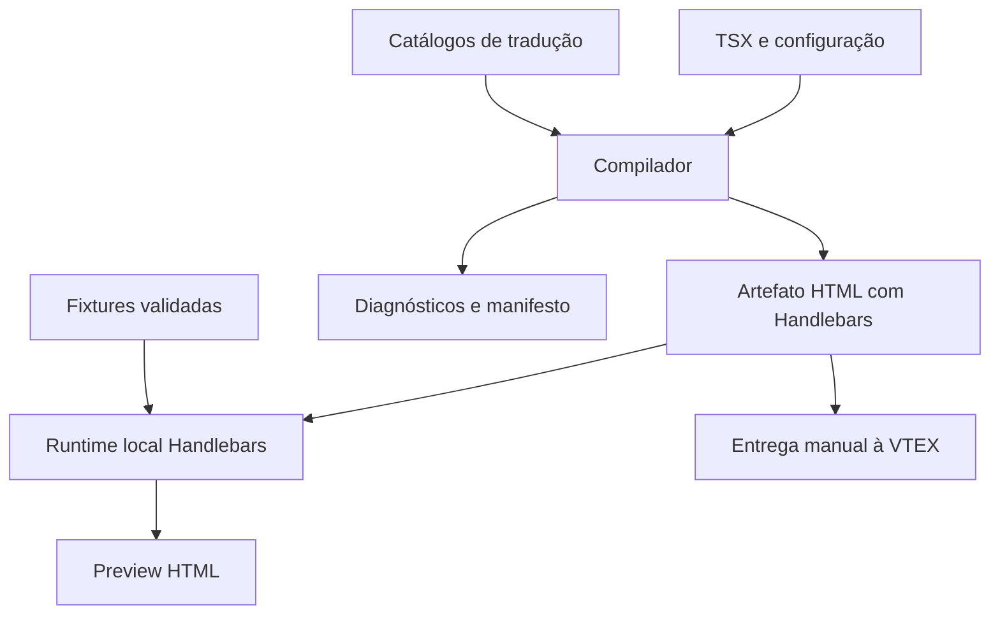

# RFC-001 — Toolchain de emails VTEX com React Email e Tailwind CSS

| Campo             | Valor                                                                      |
| ----------------- | -------------------------------------------------------------------------- |
| Status            | Proposta para implementação                                                |
| Versão            | 1.0                                                                        |
| Data              | 2026-10-01                                                                 |
| Nome de trabalho  | VTEX React Email Toolchain                                                 |
| Stack proposta    | TypeScript, React, React Email, Tailwind CSS, Handlebars, Zod, pnpm        |
| Entrega principal | HTML/CSS de email contendo expressões Handlebars para a VTEX               |
| Escopo            | Autoria, componentes, internacionalização, preview, validação e compilação |
| Fora do escopo    | Envio de emails, SMTP, credenciais VTEX e publicação automática            |

> Esta RFC especifica um produto a construir. Os nomes `@vtex-email/*`, comandos, interfaces e códigos de diagnóstico são propostas; não representam pacotes já publicados nem uma integração oficial da VTEX. As decisões internas são normativas para o projeto. A compatibilidade com serviços externos depende das evidências e dos testes definidos aqui.

## 1. Resumo

Criar uma toolchain que permita desenvolver templates transacionais VTEX em React/TSX, compor layouts com React Email e estilizar com Tailwind CSS. A compilação deve produzir arquivos independentes de JavaScript, com CSS apropriado para email e Handlebars preservado para avaliação pelo Message Center.

Dados de pedidos, clientes e pagamentos continuam sendo resolvidos pela VTEX. O React organiza a apresentação; a toolchain representa expressões dinâmicas sem executá-las durante o build. JSONs locais reproduzem cenários de eventos exclusivamente para validação e preview.

O preview deve executar o artefato compilado com Handlebars e uma fixture. Não haverá um segundo interpretador React para simular condicionais, loops ou helpers.

A internacionalização gera variantes estáticas por idioma e, quando o perfil de destino permitir, combina essas variantes em um único template com seleção de idioma em runtime.

## 2. Convenções normativas

- **DEVE / NÃO DEVE:** requisito obrigatório para a fase em que a funcionalidade é entregue.
- **DEVERIA:** comportamento recomendado; uma exceção exige justificativa técnica registrada.
- **PODE:** extensão opcional, sem compromisso de implementação no MVP.
- **Build time:** execução local/CI do compilador.
- **Runtime VTEX:** avaliação do Handlebars pela plataforma.
- **Fixture:** JSON de exemplo de um evento, preservando sua estrutura original.
- **Perfil de destino:** catálogo versionado de sintaxe, helpers e comportamentos admitidos pelo compilador para um destino VTEX.
- **IR:** representação intermediária de expressões e blocos, usada para validação e emissão.

Uma regra obrigatória não deve ser silenciosamente relaxada para fazer um template compilar. Recursos ainda não suportados devem gerar erro explícito.

## 3. Contexto e evidências

O projeto [vtex-emails-multi-languages](https://github.com/patrickgratao/vtex-emails-multi-languages) documenta dados JSON, helpers, traduções e combinação de templates por idioma. Seu README mostra seleção de locale com `compare` e o path `orders.0.clientPreferencesData.locale`. Ele é referência funcional, não garantia de comportamento para todos os eventos ou contas. A proposta reaproveita esses conceitos sem depender de seu pipeline Gulp. [S1]

A documentação VTEX descreve variáveis originadas no JSON Data, expressões Handlebars e helpers. O exemplo oficial de `formatCurrency` converte `20000` em `200,00`, sem símbolo de moeda; também há exemplos de `eq` e `hasSubStr` em blocos. A documentação contém pontos a verificar empiricamente, como a apresentação de multiplicação monetária e a semântica de timezone. [S2]

React Email oferece renderização de componentes para HTML e integração com Tailwind. A página de Tailwind registra limitações de Context dentro de seu wrapper e de seletores complexos, além de preservar media queries como CSS não inline. A toolchain deve encapsular essas diferenças de versão. [S3][S4]

### 3.1 Correções em relação ao desenho inicial

1. Não se promete remover todas as classes: seletores necessários a media queries devem permanecer.
2. Transformar Tailwind em CSS não torna toda propriedade compatível com todos os clientes de email.
3. Juice não será uma etapa obrigatória; só será habilitado após comprovação de necessidade e integridade.
4. Um helper JS local não instala funcionalidades na VTEX.
5. `compare`, seus operadores e o path de locale não são pressupostos universais.
6. Validação de fixture, validação de contrato e compatibilidade real são resultados diferentes.
7. Providers criados por blocos dinâmicos dentro de Tailwind não serão a base do controle de escopo.

## 4. Problema e objetivos

### 4.1 Problemas a resolver

- Repetição de HTML, tabelas, estilos e trechos Handlebars entre emails.
- Dificuldade de manter design e traduções consistentes.
- Dependência de eventos reais para visualizar variações de conteúdo.
- Erros de path ou helper que passam despercebidos no desenvolvimento.
- Diferença entre o que aparece no preview e o template efetivamente entregue.
- Acoplamento entre dados de teste e o HTML exportado.

### 4.2 Objetivos verificáveis

| ID     | Objetivo                             | Evidência de aceite                                          |
| ------ | ------------------------------------ | ------------------------------------------------------------ |
| OBJ-01 | Escrever layouts em TSX reutilizável | Dois templates reutilizam layout, cabeçalho e botão          |
| OBJ-02 | Preservar dados dinâmicos            | Alterar a fixture não altera os bytes do build               |
| OBJ-03 | Usar Tailwind no desenvolvimento     | Utilidades suportadas viram estilos, sem runtime Tailwind    |
| OBJ-04 | Preview fiel ao pipeline             | Preview executa o mesmo artefato e seletor de locale         |
| OBJ-05 | Internacionalização                  | Dois idiomas e fallback testados no artefato combinado       |
| OBJ-06 | Diagnósticos acionáveis              | Erros identificam template, regra, path e origem disponível  |
| OBJ-07 | Operar sem credenciais               | Build, preview e validação funcionam offline após instalação |
| OBJ-08 | Portabilidade                        | Fluxo validado em Windows, Linux e macOS                     |
| OBJ-09 | Reprodutibilidade                    | Mesmas entradas e versões produzem saída idêntica            |

### 4.3 Não objetivos

Não implementar envio, SMTP, campanhas, editor visual drag-and-drop, sincronização automática com Message Center, consulta de pedidos em produção, hospedagem de assets, tradução automática, conversão geral de JavaScript para Handlebars ou promessa de fidelidade visual universal.

Não criar um novo React Email, um compilador Tailwind próprio ou uma implementação própria da linguagem Handlebars.

## 5. Usuários e fluxos

### 5.1 Desenvolvedor de templates

1. Define um email com contrato, traduções, fixtures e componente.
2. Executa `vtex-email dev`.
3. Seleciona template e fixture; inspeciona conteúdo e diagnósticos.
4. Ajusta componentes e estilos com atualização automática.
5. Executa `validate` e `build`.
6. Copia o artefato aprovado para o campo correspondente no Message Center.

### 5.2 Revisor

Compara estados representativos: itens múltiplos, retirada, pedidos separados, dados opcionais, textos longos e idiomas. A revisão inclui HTML gerado, diferenças visuais e relatório de compatibilidade.

### 5.3 Mantenedor da toolchain

Adiciona capacidades de destino com assinatura, evidência, simulador e testes de contrato. Uma mudança de dependência exige regressão de renderização e de preservação de Handlebars.

## 6. Arquitetura



### 6.1 Pacotes

| Pacote proposto       | Responsabilidade                                                | Não deve conter                                    |
| --------------------- | --------------------------------------------------------------- | -------------------------------------------------- |
| `@vtex-email/core`    | IR, paths, emissão HBS, compilação, i18n e diagnósticos         | UI, servidor HTTP ou estado global de build        |
| `@vtex-email/react`   | DSL `Vtex`, `Trans`, `Email` e adaptador React Email/Tailwind   | Fixtures, envio ou regras específicas de um pedido |
| `@vtex-email/vtex`    | Perfis, catálogo de helpers, simuladores e contratos de exemplo | Acesso automático a contas VTEX                    |
| `@vtex-email/cli`     | Configuração, descoberta, comandos e escrita de artefatos       | Implementação duplicada de compilação              |
| `@vtex-email/preview` | Servidor Vite local, plugin interno e interface de inspeção     | Outro interpretador da DSL; plugin Vite público    |

Contratos comuns ficam no core. O core recebe o renderizador e o perfil de destino como dependências; não importa a CLI ou a UI. O adaptador React depende dos contratos do core, evitando ciclo entre os dois. A CLI faz a composição.

Os módulos devem ser pequenos por responsabilidade, sem impor uma classe ou interface a cada função. Design patterns só entram quando resolvem uma necessidade concreta, como estratégia de emissão por perfil ou adaptador de renderização.

### 6.2 Base técnica e versões

- Monorepo pnpm; TypeScript estrito; módulos ESM.
- Node.js LTS suportado pelas dependências escolhidas, fixado no início da implementação.
- React e React Email com matriz explícita de versões compatíveis.
- A versão de Tailwind deve acompanhar o adaptador testado do React Email; não atualizar isoladamente.
- Handlebars em instância isolada por perfil/sessão, sem registro global de helpers.
- Zod para contratos; validação não deve transformar silenciosamente os dados usados no preview.
- Um único test runner; Vitest é a escolha proposta. Playwright para integração da UI quando necessário.
- Bundler TSX dos templates com suporte a sourcemaps, como esbuild, encapsulado em um adaptador. O servidor e os assets da UI de preview usam Vite; a compilação dos emails não passa por `vite build`.
- Lockfile versionado; instalações de CI em modo frozen; versões concretas documentadas na fase P0.

## 7. Organização do repositório e projeto consumidor

| Caminho                 | Conteúdo                                 |
| ----------------------- | ---------------------------------------- |
| `packages/core/`        | Contratos e pipeline                     |
| `packages/react/`       | Componentes e integração de renderização |
| `packages/vtex/`        | Perfis e helpers                         |
| `packages/cli/`         | Executável                               |
| `packages/preview/`     | Interface e servidor                     |
| `examples/basic-store/` | Projeto consumidor executável            |
| `tests/contracts/`      | Casos esperados do destino               |
| `tests/golden/`         | Artefatos de regressão                   |
| `docs/`                 | Guia, referência, decisões e limitações  |

Um projeto consumidor contém `vtex-email.config.ts`, `emails/`, `components/`, `schemas/`, `fixtures/`, `locales/`, `assets/` e `dist/`. Exemplos de nomes: `emails/order-confirmed.email.tsx`, `fixtures/order-confirmed/default.json` (ou `.jsonc` com sidecar `default.meta.json`), `locales/pt-BR.json`.

`dist/` e cache são gerados. Arquivos de configuração, fixtures sanitizadas, schemas, traduções e componentes são versionados. Nenhum arquivo secreto é necessário.

## 8. Configuração pública proposta

```ts
import { defineConfig } from '@vtex-email/cli'

export default defineConfig({
  emails: ['emails/**/*.email.tsx'],
  outDir: 'dist',
  fixturesDir: 'fixtures',
  schemasDir: 'schemas',
  target: { profile: './vtex-target.json' },
  i18n: {
    locales: ['pt-BR', 'en-US', 'es-CO'],
    defaultLocale: 'pt-BR',
    catalogs: 'locales/{locale}.json',
    missingKey: 'error',
    localePath: 'locale',
  },
  tailwind: {
    preset: 'email-safe',
    theme: {
      extend: { colors: { brand: '#E1251B' } },
    },
  },
  validation: {
    unknownPath: 'error',
    unverifiedCapability: 'error',
    warningsAsErrors: false,
  },
  compatibility: {
    policy: 'conservative',
    maxSourceBytes: 250_000,
    warnRenderedBytes: 90_000,
  },
  preview: { host: '127.0.0.1', port: 3000 },
})
```

Os limites de bytes acima são políticas iniciais do projeto, não limites oficiais VTEX ou garantias contra truncamento em clientes. Devem ser configuráveis e identificados como tal nos relatórios.

Regras de configuração:

- Erro em chave desconhecida; nenhum typo deve ser ignorado.
- Paths resolvidos em relação ao diretório da configuração, não ao cwd ocasional.
- IDs únicos e restritos a caracteres seguros para nomes de arquivo.
- `outDir` não pode coincidir com diretório de fontes, raiz do projeto ou ancestral dela.
- Overrides por email (`settings`) são permitidos apenas para campos documentados; a precedência é settings → projeto → convenção do arquivo.
- `schemasDir` (default `schemas`) associa `{schemasDir}/{fileKey}.ts` com `export default` Zod à chave do arquivo (basename sem `.email.tsx`).
- `i18n.localePath` no projeto é o default; se ausente no projeto e no email, a resolução falha com diagnóstico.
- Configuração TypeScript é código confiável local, não um formato seguro para executar projetos de terceiros.

## 9. Definição de email

O default export é o componente React. Overrides opcionais ficam em `export const settings`.

```tsx
import type { EmailSettings } from '@vtex-email/core'
import { Email, Trans, Vtex } from '@vtex-email/react'

export const settings = {
  i18n: {
    localePath: 'orders.0.clientPreferencesData.locale',
    output: 'merged',
    aliases: { 'pt-br': 'pt-BR' },
  },
} satisfies EmailSettings

export default function OrderConfirmed() {
  return (
    <Email className="m-0 bg-white font-sans">
      {/* … */}
    </Email>
  )
}
```

Exemplo mínimo (quando `{schemasDir}/{fileKey}.ts` e `localePath` do projeto bastam):

```tsx
import { Email, Trans, Vtex } from '@vtex-email/react'

export default function AuthCode() {
  return (
    <Email className="m-0 bg-white font-sans">{/* … */}</Email>
  )
}
```

Para `auth-code.email.tsx`, a chave é `auth-code`: `id`/`event` default, fixtures em `{fixturesDir}/auth-code/`, schema em `{schemasDir}/auth-code.ts` (`export default`). Sobrescrever `id` ou `event` em `settings` não muda a pasta de fixtures nem o arquivo de schema.

`event` é metadado local, não um identificador registrado automaticamente na VTEX. O schema e o `localePath` devem corresponder ao JSON do evento escolhido. Não se presume que todo evento contenha `orders`.

O componente não recebe o JSON da fixture como props. Ele pode receber configuração estática aprovada — tema, marca e parâmetros de composição — mas não dados de pedido resolvidos localmente.

Fixtures aceitam `.json` (estrito) e `.jsonc` (comentários e trailing commas). Ambas exigem o sidecar `{id}.meta.json`. Colisão entre `default.json` e `default.jsonc` é erro.

Um assunto pode ser definido como expressão textual separada em fase posterior. O corpo HTML nunca deve ser reutilizado como assunto. O suporte de helpers nesse campo exige sua própria verificação de destino.

## 10. DSL React para dados dinâmicos

### 10.1 Exemplo completo de autoria

```tsx
import { Email, Heading, Section, Text, Vtex, Trans, expr } from '@vtex-email/react'

export function OrderConfirmed() {
  return (
    <Email className="m-0 bg-gray-100 font-sans">
      <Section className="mx-auto w-full max-w-[600px] bg-white p-6">
        <Heading className="m-0 text-2xl font-bold text-brand">
          <Trans id="order.confirmed.title" />
        </Heading>

        <Vtex.Each path="orders">
          <Text>
            <Trans id="common.hello" /> <Vtex.Value path="clientProfileData.firstName" />
          </Text>
          <Text>
            <Trans id="order.number" /> <Vtex.Value path="orderId" />
          </Text>

          <Vtex.Each path="items">
            <Text className="text-sm text-gray-700">
              <Vtex.Value path="quantity" />
              {' × '}
              <Vtex.Value path="name" />
            </Text>
            <Text>
              R$ <Vtex.Helper name="formatCurrency" args={[expr.path('sellingPrice')]} />
            </Text>
          </Vtex.Each>

          <Vtex.If path="shippingData.address">
            <Text>
              <Vtex.Value path="shippingData.address.street" />
            </Text>
          </Vtex.If>
        </Vtex.Each>
      </Section>
    </Email>
  )
}
```

O símbolo `R$` é uma decisão deste exemplo de loja, não um efeito de locale. Uma loja multimoeda deve explicitar a política de moeda suportada pelo evento; mudar o idioma não converte valores.

### 10.2 Componentes e semântica

| API                                | Emissão conceitual                | Contrato                                             |
| ---------------------------------- | --------------------------------- | ---------------------------------------------------- |
| `Vtex.Value path="orderId"`        | `{{orderId}}`                     | Valor com escaping Handlebars                        |
| `Vtex.Each path="items"`           | `{{#each items}}…{{/each}}`       | Iteração dinâmica; muda contexto                     |
| `Vtex.If path="address"`           | `{{#if address}}…{{/if}}`         | Truthiness do perfil Handlebars                      |
| `Vtex.Unless path="address"`       | `{{#unless address}}…{{/unless}}` | Negação do teste                                     |
| `Vtex.With path="address"`         | `{{#with address}}…{{/with}}`     | Contexto aninhado; fase posterior                    |
| `Vtex.Helper name args`            | `{{helper arg1 arg2}}`            | Helper inline registrado no perfil                   |
| `Vtex.BlockHelper name args`       | `{{#helper args}}…{{/helper}}`    | Helper de bloco com semântica declarada              |
| `Vtex.Compare left operator right` | Emissor do perfil                 | Comparação apenas se a capacidade estiver habilitada |
| `Trans id values`                  | Texto do catálogo + expressões    | Tradução estática por variante                       |

Todos os blocos aceitam `fallback?: ReactNode`, representando `{{else}}`. `Vtex.Each` no MVP aceita arrays; iteração de objetos fica fora do contrato inicial. `Vtex.FormatCurrency path` pode ser um atalho transparente para `Vtex.Helper`, sem lógica adicional.

Exemplos:

```tsx
<Vtex.If path="shippingData.address" fallback={<Text>Retirada</Text>}>
  <Address />
</Vtex.If>

<Vtex.Compare
  left={expr.path('split')}
  operator="!="
  right={expr.literal(true)}
>
  <Payment />
</Vtex.Compare>

<Vtex.Helper
  name="replace"
  args={[
    expr.path('shippingEstimate'),
    expr.literal('bd'),
    expr.literal(' business days'),
  ]}
/>
```

A API de comparação usa operandos explícitos para evitar ambiguidade entre path e string literal. Operadores desconhecidos ou não verificados para o perfil causam erro; não se deve substituí-los por uma aproximação JavaScript.

### 10.3 Regras de escopo

- Paths são relativos ao contexto atual.
- `each` e `with` criam o contexto descrito pelo perfil; `if` e `unless` preservam o contexto.
- `../`, `@root`, `this`, índices e variáveis como `@index`/`@first`/`@last` só são liberados com suporte do perfil e testes.
- Inicialmente suportar propriedades comuns, índices numéricos e `../`; sintaxes de segmentos especiais devem ser explicitamente documentadas.
- O parser aceita um subconjunto deliberado de paths, não qualquer string interpolada.
- `orders.0.items` pode ser normalizado para a sintaxe aceita pelo destino; a transformação deve ser testada.
- Escopo do `fallback` de `each` não deve presumir um item inexistente. Sua resolução deve seguir o runtime Handlebars selecionado.
- Blocos de helper declaram se preservam ou alteram contexto. Sem essa declaração, sua compilação é rejeitada.
- A análise usa a estrutura aninhada final da IR; não depende de um contador global ou de Context React criado dentro de Tailwind.

No Handlebars documentado, o teste de `if` trata `0`, string vazia e array vazio como falsos. A toolchain não deve substituir isso por `Boolean(valor)` em JavaScript. [S5]

### 10.4 Atributos dinâmicos

Usar wrappers explícitos para que objetos de expressão não sejam convertidos acidentalmente em strings por componentes React:

```tsx
<Vtex.Link href={expr.path('orderUrl')}>
  <Trans id="order.view" />
</Vtex.Link>

<Vtex.Button href={expr.path('orderUrl')} className="bg-brand px-6 py-3">
  <Trans id="order.view" />
</Vtex.Button>

<Vtex.Img
  src={expr.path('imageUrl')}
  alt={expr.path('name')}
  width={96}
  height={96}
/>
```

Wrappers aceitam string estática ou expressão tipada para os atributos documentados. Uma string comum é sempre literal; `href="orderUrl"` não significa path. Referências devem ser passadas com `expr.path`.

MVP: `href`, `src`, `alt` e `title`. Não suportar expressões dinâmicas em nome de tag, nome de atributo, `className`, CSS ou `style`.

Concatenação de URL pode ser uma extensão posterior, mas escaping HTML não equivale a URL encoding. Valores usados em segmentos ou query strings precisam já estar corretamente codificados ou depender de capacidade verificada do destino; não inventar helper de encoding.

### 10.5 Lógica permitida em React

Permitidos: composição, constantes, tokens de tema, props estáticas e `.map()` sobre listas estáticas de navegação/conteúdo.

Proibidos: importar fixture no template, usar dados de pedido em `if`, ternário ou `.map()`, chamar rede, ler relógio ou gerar aleatoriedade durante renderização.

A toolchain deve bloquear importações de fixtures e bibliotecas de preview no grafo do template, além de fornecer lint para fontes óbvias de não determinismo. Não se promete provar a pureza de todo programa TypeScript arbitrário. O teste de invariância de fixtures complementa a análise estática.

## 11. Compilador e representação intermediária

### 11.1 Contratos centrais

```ts
type Expression =
  | { kind: 'path'; value: string }
  | { kind: 'literal'; value: string | number | boolean | null }
  | { kind: 'helper'; name: string; args: Expression[] }

interface Diagnostic {
  code: string
  severity: 'error' | 'warning' | 'info'
  message: string
  templateId?: string
  locale?: string
  fixtureId?: string
  source?: { file: string; line?: number; column?: number }
  path?: string
  suggestion?: string
}

interface CompileResult {
  artifacts: Array<{
    name: string
    content: string
    sha256: string
  }>
  diagnostics: Diagnostic[]
  manifest: BuildManifest
}
```

Expressões auxiliares aninhadas só são aceitas quando o destino suporta subexpressões. A existência de um tipo na IR não habilita automaticamente sua emissão.

### 11.2 Sequência obrigatória

1. Carregar e validar configuração, módulos, dependências e perfil.
2. Descobrir emails e detectar IDs duplicados.
3. Validar catálogos e resolver variantes de idioma.
4. Criar contexto de compilação isolado por email e locale.
5. Renderizar React Email/Tailwind, transportando operações dinâmicas como marcadores opacos.
6. Processar CSS/HTML apenas nas etapas aprovadas para preservar esses marcadores.
7. Reconstruir a IR dos marcadores; validar aninhamento, paths, helpers e contextos de atributos.
8. Emitir Handlebars com serialização segura de paths e argumentos.
9. Validar sintaxe HBS e capacidades do perfil.
10. Combinar variantes de idioma, quando solicitado.
11. Validar fixtures e executar a matriz de preview usando o artefato resultante.
12. Escrever artefatos e manifesto atomicamente somente se os requisitos de build forem satisfeitos.

Nenhum otimizador que interprete HTML deve processar o template após a restauração de Handlebars sem teste explícito de preservação. O parser HBS, a inspeção textual e o cálculo de hash continuam permitidos.

### 11.3 Estratégia de marcadores

Adotar inicialmente marcadores opacos associados a descritores tipados. Um valor não precisa emitir `{{orderId}}` durante React; pode emitir um identificador interno restaurado após a renderização.

Requisitos:

- Namespace reservado; colisões com textos do projeto causam erro.
- Identidade determinística baseada em descritor e origem quando disponível; sem UUID aleatório no artefato.
- Registro isolado por compilação, sem variável global mutável compartilhada entre renders.
- Marcadores de abertura, alternativa e fechamento formam uma sequência balanceada.
- Repetições introduzidas pelo renderizador devem ser reconhecidas e validadas por contexto, inclusive HTML condicional de Outlook; não aplicar a regra ingênua de uma ocorrência por expressão.
- Não interpretar strings externas como descritores executáveis.
- Nenhum marcador pode permanecer em `dist`.
- Erro se marcador for truncado, movido para contexto inválido ou restaurado em atributo proibido.
- Não decodificar entidades HTML globalmente para recuperar expressões; restauração deve atuar apenas em tokens reconhecidos.

**A estratégia é uma hipótese técnica sujeita ao gate P0.** Texto sentinela entre elementos de tabela pode ser movido por parsers HTML. A prova deve cobrir essa situação antes de liberar inlining, minificação ou normalização de DOM. Se não houver transporte confiável, substituir o mecanismo por lowering estrutural próprio antes da renderização; não remendar o HTML com regex genérica.

### 11.4 Integração com React e Tailwind

`Email` centraliza `Html`, `Head`, `Body`, Tailwind e configuração visual. Providers necessários ao ambiente de compilação ficam acima do wrapper Tailwind. Blocos da DSL não criam providers aninhados para simular escopo dinâmico.

O adaptador deve provar que traduções, componentes customizados e classes internas são processados pela versão escolhida. Se usar um contexto assíncrono no servidor para emissão de tokens, ele deve ser local à execução, reentrante e testado com compilação concorrente. Não é um estado global da aplicação.

Source locations devem vir do carregamento/transformação TSX ou sourcemaps. Quando a localização exata não estiver disponível, reportar arquivo, template e identificador de expressão; nunca inventar linha/coluna.

## 12. Tailwind, CSS e HTML de email

### 12.1 Política de estilos

| Categoria                                        | Política inicial                                                       |
| ------------------------------------------------ | ---------------------------------------------------------------------- |
| Cores, tipografia, espaçamento, bordas simples   | Compilar e validar CSS emitido                                         |
| Larguras, tabelas, alinhamento                   | Favorecer componentes de email e fallbacks                             |
| Responsividade                                   | Preservar regras em `style` e classes necessárias                      |
| `flex`, `grid`, posicionamento e transforms      | Diagnosticar conforme matriz de clientes; evitar no preset conservador |
| `hover`, seletores compostos, `space-*`, `prose` | Exigir suporte demonstrado do adaptador e do cliente-alvo              |
| Variáveis CSS e formatos de cor modernos         | Resolver quando possível; avisar/erro se o perfil não suportar         |
| Classes derivadas do payload                     | Rejeitar no MVP                                                        |

O preset `email-safe` é uma política própria, não uma certificação. Deve favorecer unidades em px, cores explícitas e layouts com `Section`, `Row` e `Column`. As opções reais do Tailwind ficam encapsuladas pelo adaptador, sem prometer que qualquer `tailwind.config` arbitrário funcionará.

O lint deve inspecionar também CSS inline e `<style>`, porque um template pode introduzir propriedades incompatíveis sem usar classes Tailwind.

### 12.2 Responsividade

O template deve ter um layout base legível sem media queries. Estilos responsivos são melhoria progressiva. O `<Head>` deve ser emitido corretamente para receber as regras necessárias.

Não remover classes referenciadas por CSS preservado, comentários condicionais MSO ou atributos exigidos pelo renderizador. Não tratar `border-radius`, fontes externas ou efeitos visuais como essenciais à compreensão do conteúdo.

### 12.3 Inlining adicional

Desativado por padrão. React Email/Tailwind é responsável pela transformação principal. Um adaptador Juice opcional pode atender CSS legado, desde que preserve queries, regras condicionais, precedência e marcadores.

É obrigatório comparar o resultado com e sem a etapa para garantir que ela não destrói expressões, reordena blocos ou altera estilos indevidamente. Duplo inlining não deve ocorrer por acidente.

### 12.4 Compatibilidade e acessibilidade

Matriz inicial de validação manual: Gmail web/mobile, Apple Mail/iOS, Outlook web e Outlook clássico Windows, com versões e datas registradas no relatório. Uma visualização Chromium não substitui essa verificação.

Exigir `alt` em imagens informativas, textos de link compreensíveis, ordem de leitura coerente, idioma do documento, contraste adequado e tabelas de layout com semântica apropriada quando suportado. O linter deve indicar quais verificações são automatizadas e quais dependem de revisão.

Não emitir uma mensagem genérica “compatibilidade garantida”. Reportar regras verificadas, advertências e evidências reais por cliente.

## 13. Internacionalização

### 13.1 Catálogos

JSON UTF-8 com chaves estáveis. No MVP, usar chaves planas e mensagens textuais:

```json
{
  "order.confirmed.title": "Pedido confirmado",
  "order.number": "Pedido",
  "common.hello": "Olá",
  "order.view": "Ver pedido",
  "order.greeting": "Olá, {firstName}!"
}
```

Interpolação tipada:

```tsx
<Trans id="order.greeting" values={{ firstName: expr.path('clientProfileData.firstName') }} />
```

O parser de mensagens distingue texto e placeholders. O texto passa pelo escaping React; expressões dinâmicas passam pelo pipeline de tokens/HBS. Não há concatenação insegura de HTML.

### 13.2 Regras obrigatórias

- Chave ausente em idioma habilitado: erro de build por padrão.
- Placeholders devem coincidir entre idiomas; faltantes/extras são erro.
- Tradução não aceita HTML arbitrário, expressões HBS nem delimitadores `{{`/`}}` no MVP.
- Mensagens ricas com componentes e pluralização dinâmica ficam para fase posterior.
- Fallback de idioma não deve ocultar chave de tradução ausente.
- Data, número e moeda não são automaticamente internacionalizados só porque o catálogo muda.
- Catálogos e sua ordem de resolução entram no fingerprint do build.

### 13.3 Seleção de locale

Cada evento configura seu path. Locale ausente, nulo, vazio ou desconhecido cai no `defaultLocale`. O default deve constar na lista de idiomas. Aliases, como `pt-br` → `pt-BR`, devem ser declarados e compilados em branches explícitos; não normalizar só no preview.

O seletor usa uma capacidade de igualdade habilitada no perfil. Se `compare` não estiver verificado, não deve ser emitido só porque existe no projeto de referência. Um perfil pode usar `eq` se seu contrato tiver sido estabelecido.

### 13.4 Estratégia de merge

MVP: cada branch contém um documento completo e é mutuamente exclusivo. O template HBS combinado pode conter vários documentos como fonte; depois da avaliação, deve resultar em exatamente um doctype, um `html`, um `head` e um `body`.

Exemplo conceitual, condicionado a um perfil com `eq` validado:

```handlebars
{{#eq orders.[0].clientPreferencesData.locale 'en-US'}}
  <html lang='en-US'>…</html>
{{else}}
  <html lang='pt-BR'>…</html>
{{/eq}}
```

Não inserir documentos completos dentro do `body` de outro documento. Não analisar a fonte combinada como se já fosse o HTML de um email entregue. As verificações de estrutura HTML operam após resolver cada branch com fixtures.

Essa estratégia aumenta o tamanho da fonte, mas evita mesclar heads/CSS de forma prematura. Deve ser homologada no Message Center em P0/P2. Se o destino não aceitar o formato, entregar variantes separadas até aprovar uma estratégia de shell único; não alterar silenciosamente a semântica.

### 13.5 Modos de saída e preview

- `per-locale`: um arquivo por idioma, sem seleção automática.
- `merged`: um artefato para VTEX e variantes auxiliares identificadas no manifesto.
- Preview “runtime”: utiliza o locale contido na fixture e o artefato combinado; é o modo padrão.
- Preview “forçar locale”: clona a fixture, substitui apenas o path configurado e passa pelo mesmo seletor; mostra essa alteração na UI e não modifica o arquivo.
- Uma visualização de variante isolada deve ser identificada como tal e não conta como teste do seletor.

## 14. Helpers e perfis VTEX

### 14.1 Catálogo de capacidades

Cada helper deve registrar nome de emissão, tipo inline/bloco, aridade, tipos admitidos, regras de contexto, escaping de saída, simulador local, evidência e limitações conhecidas.

Classificação de evidência:

| Estado         | Significado                                                  |
| -------------- | ------------------------------------------------------------ |
| `documented`   | Aparece em fonte oficial, mas pode ter detalhes sem teste    |
| `verified`     | Há evidência de execução no destino para os casos declarados |
| `experimental` | Só há referência indireta ou semântica incompleta            |

Esses estados não são equivalentes a aprovação universal. O perfil relaciona cada capacidade à evidência pertinente. A versão local de Handlebars não deve ser anunciada como a versão interna da VTEX sem confirmação.

### 14.2 Escopo inicial

Priorizar `each`, `if`, `unless`, interpolação escapada e `formatCurrency`. Adicionar igualdade para i18n, `replace`, datas, `hasSubStr` e operadores de comparação conforme contratos verificados.

Para `formatCurrency`, testar zero, valor inteiro em centavos, negativo, limite de magnitude, string numérica e ausência. Valores não cobertos pelo contrato devem produzir diagnóstico, não aproximação silenciosa. Não converter centavos no React antes de aplicar o helper.

Datas exigem decisões explícitas sobre formato de entrada e timezone. O simulador nunca deve depender do timezone da máquina. Quando o comportamento real não estiver estabelecido, mostrar limitação e impedir uma alegação de equivalência.

### 14.3 Extensões

Um helper customizado pode simular localmente uma capacidade já comprovada do destino. Registrar função JS não o torna utilizável na VTEX. Helpers só locais não podem aparecer em artefatos destinados à plataforma.

Se for necessário transformar um valor exclusivamente em build time, ele precisa ser estático. Transformações sobre dados de evento devem ser expressas em capacidades reais do destino ou excluídas do escopo.

`build` recusa capacidades desconhecidas. Uma opção explícita de desenvolvimento pode permitir capacidades experimentais, marcando o manifesto como não homologado; essa opção não satisfaz os critérios de release de produção.

## 15. Fixtures, schemas e validação de paths

### 15.1 Contratos de dados

Cada evento deve possuir schema representativo dos campos consumidos. Campos desconhecidos devem ser preservados, usando o equivalente a passthrough/loose object da versão escolhida do Zod.

Exemplo conceitual:

```ts
const ItemSchema = z
  .object({
    name: z.string(),
    quantity: z.number().int(),
    sellingPrice: z.number().int(),
  })
  .passthrough()

const OrderConfirmedSchema = z
  .object({
    orders: z.array(
      z
        .object({
          orderId: z.string(),
          clientProfileData: z
            .object({
              firstName: z.string().optional(),
            })
            .passthrough(),
          items: z.array(ItemSchema),
        })
        .passthrough(),
    ),
  })
  .passthrough()
```

O exemplo é parcial; o contrato usado pelo template completo deve também descrever endereço e preferências de locale. Não pressupor que `.passthrough()` torne todo path desconhecido correto.

Transforms, coerções e defaults de schema não devem alterar a fixture antes do preview. Validar sem mutar e renderizar os dados originais. Se um recurso futuro oferecer normalização, deve ser separado e identificado como divergência do payload real.

### 15.2 Origem de fixtures

Preferir JSON Data do evento pretendido, sanitizado, ou fixture sintética com o mesmo formato. Dados de uma API de pedido podem ajudar a compor o exemplo, mas não substituem a confirmação do envelope do evento.

Cada cenário deve ter metadados externos ao payload: descrição, origem, evento, finalidade e resultado esperado de locale/branches. Não adicionar metadados de desenvolvimento ao JSON enviado ao interpretador como se fossem campos VTEX.

### 15.3 Matriz mínima

| Cenário                                   | Risco coberto                 |
| ----------------------------------------- | ----------------------------- |
| Pedido simples                            | Fluxo base                    |
| Múltiplos itens                           | Iteração                      |
| Mais de um pedido/seller                  | Contextos aninhados           |
| Endereço ausente / retirada               | Condicional e opcionalidade   |
| Array vazio                               | Fallback sem contexto de item |
| Texto longo e caracteres especiais        | Layout e escaping             |
| Locale conhecido, ausente e desconhecido  | Seletor e fallback            |
| Zero e valores monetários representativos | Contrato de helper            |
| Dados inválidos                           | Diagnósticos negativos        |

Fixtures negativas ficam em conjunto separado, com resultado de falha esperado; não podem tornar o build normal permanentemente inválido.

### 15.4 Três níveis de validação

1. **Schema:** o payload respeita o contrato do evento?
2. **Referências:** os paths e argumentos são compatíveis com schema e escopo?
3. **Execução:** o artefato funciona nos cenários declarados, sem resultados inesperados?

Um campo opcional ausente não é automaticamente um typo. Se o schema o declara opcional e a utilização é protegida, a ausência pode ser válida. Path inexistente no contrato é erro, mesmo que o schema preserve outros campos.

Array vazio não comprova nem invalida a estrutura do item. Usar o schema para essa estrutura e registrar falta de cobertura concreta. Unions exigem análise por variante; não declarar impossibilidade apenas porque um campo não aparece em todas.

Schemas complexos que o analisador não consegue inspecionar devem gerar `PATH_UNANALYZABLE`, com possibilidade de contrato de paths explícito. Não depender silenciosamente de internals instáveis do Zod.

### 15.5 Limites de tipagem

O MVP oferece props e expressões tipadas, mas paths podem continuar strings validadas pelo compilador. Autocomplete de paths derivado do schema é evolução posterior. Não vender tipagem completa de escopos aninhados antes de implementá-la e testá-la.

## 16. Preview local

A interface deve apresentar lista de emails, seletor de fixture, locale runtime/forçado, viewport desktop/mobile, HTML renderizado, template HBS, diagnósticos e metadados do cenário.

Requisitos:

- Watch de templates, componentes, configuração, schemas e traduções, coordenado pelo servidor Vite do preview.
- Alterar apenas fixture deve reexecutar validação/renderização, sem recompilar o TSX desnecessariamente.
- Alterar apenas o schema Zod deve revalidar paths e fixtures, sem recompilar o template.
- Invalidação por dependência real; mudança de componente compartilhado atualiza todos os consumidores afetados.
- Compilar alterações com debounce e descartar resultado obsoleto de execução anterior.
- Se o build falhar, manter o último preview válido com aviso visível de desatualização.
- Exibir erros locais de helper e limitações do perfil.
- Usar iframe isolado; email não executa scripts e links não navegam a aplicação de preview.
- Bind local por padrão; exposição na rede exige opção explícita.
- Exportar preview resolvido apenas por comando explícito, em diretório diferente de `dist`.

“Mobile” significa largura de viewport, não emulação fiel de um aplicativo de email. Imagens remotas podem realizar requisições ao visualizar; oferecer modo que as bloqueie. O compilador não deve buscá-las durante o build.

## 17. CLI

| Comando                                                               | Resultado                                                 |
| --------------------------------------------------------------------- | --------------------------------------------------------- |
| `vtex-email dev`                                                      | Servidor de preview com watch                             |
| `vtex-email build`                                                    | Compila todos os emails                                   |
| `vtex-email build order-confirmed`                                    | Compila apenas o ID selecionado                           |
| `vtex-email validate`                                                 | Verifica contratos, expressões, traduções, CSS e fixtures |
| `vtex-email validate --format json`                                   | Diagnósticos estruturados para CI                         |
| `vtex-email preview order-confirmed --fixture default --out preview/` | Exporta HTML resolvido de um cenário                      |

Opções comuns: `--config`, `--format`, `--warnings-as-errors`. `build --locale pt-BR` deve produzir variante isolada identificada, nunca sobrescrever silenciosamente o template combinado.

`validate` pode executar compilação em memória; não escreve artefatos de produção. `build` deve executar os gates necessários mesmo se `validate` não tiver sido chamado antes. Não fornecer flag genérica que ignore erros estruturais.

Exit codes: `0` sucesso; `1` falha de validação/compilação; `2` uso/configuração inválida. Logs humanos em stderr quando stdout contém JSON. Sem cores quando não há TTY ou quando desabilitadas. Resultado JSON versionado e estável.

Não existem comandos `send`, `deploy` ou `sync` no escopo.

## 18. Artefatos e manifesto

| Artefato                                  | Uso                                                       |
| ----------------------------------------- | --------------------------------------------------------- |
| `dist/order-confirmed.html`               | Template combinado HTML + HBS, quando configurado         |
| `dist/locales/pt-BR/order-confirmed.html` | Variante de idioma                                        |
| `dist/manifest.json`                      | Inventário e metadados de build                           |
| `dist/diagnostics.json`                   | Diagnósticos, se solicitado                               |
| `preview/order-confirmed.default.html`    | Conteúdo resolvido; nunca publicar como template dinâmico |

Manifesto obrigatório: versão de formato, compiler/adaptadores/perfil, template/evento, locales, arquivos de saída, hashes SHA-256, capacidades usadas, estado de homologação e avisos pertinentes. Não incluir conteúdo das fixtures, credenciais ou caminhos absolutos da máquina.

Timestamps não entram em artefatos determinísticos. Se desejados, ficam em log externo. Hash do template depende de fontes, tema, catálogo, configuração e versões de compilação; não de qual fixture está selecionada no preview. Relatórios de validação podem refletir alterações em fixtures.

Escrita deve ocorrer em diretório temporário e ser promovida após sucesso. Um build parcial só substitui artefatos do email selecionado e atualiza seu inventário; não apaga saídas de outros emails. Limpeza só remove arquivos identificados como gerados pela toolchain.

## 19. Segurança, escaping e fronteiras de confiança

### 19.1 Código e conteúdo

Templates/configuração são código local confiável. A ferramenta não é sandbox para TSX de terceiros. Fixtures são dados, sem execução de funções ou JavaScript. Limitar tamanho, profundidade e quantidade de itens para evitar travamentos acidentais no preview.

### 19.2 Escaping

- Interpolação dinâmica usa `{{valor}}` por padrão.
- Triple braces, `SafeString` indiscriminado e `dangerouslySetInnerHTML` com dados dinâmicos ficam proibidos no MVP.
- Paths e nomes de helpers são analisados, não concatenados sem validação.
- Literais são serializados com regras da linguagem HBS; aspas, barras e caracteres especiais têm testes dedicados.
- Texto estático e tradução com delimitadores HBS devem ser rejeitados no MVP para evitar interpretação acidental na etapa final.
- Rejeitar acesso a `__proto__`, `prototype` e `constructor` na DSL; runtime local sem acesso a protótipos.
- Não executar novamente HBS que apareça dentro de um valor da fixture; o runtime tem uma única avaliação.

### 19.3 URLs e assets

URLs estáticas devem usar esquemas permitidos; inicialmente HTTPS, com `mailto:` e `tel:` onde aplicáveis. `javascript:`, `data:` e conteúdo executável são rejeitados no perfil conservador.

Para URLs dinâmicas, o compilador verifica fixtures e documenta a origem esperada, mas não consegue garantir o conteúdo futuro recebido pela VTEX. HTML escaping não valida esquema de URL. Essa limitação precisa constar no contrato do componente.

Assets de produção devem possuir URL pública definitiva. Paths locais são permitidos no preview, mas bloqueiam build de produção sem mapeamento explícito. A toolchain não faz upload de imagens.

### 19.4 Dados pessoais

Fixtures de exemplo devem conter nomes, emails, telefones, documentos, endereços e tokens fictícios. Logs e diagnósticos mostram paths e tipos, evitando despejar payload completo. Preview exportado não deve entrar em `dist` nem ser versionado por padrão.

## 20. Diagnósticos

| Código              | Severidade padrão | Situação                                            |
| ------------------- | ----------------- | --------------------------------------------------- |
| `CFG001`            | Erro              | Configuração inválida                               |
| `DSL001`            | Erro              | Fixture importada pelo template                     |
| `DSL002`            | Erro              | Expressão em contexto não suportado                 |
| `HBS001`            | Erro              | Sintaxe ou blocos inválidos                         |
| `HBS002`            | Erro              | Helper/capacidade não habilitada                    |
| `TOK001`            | Erro              | Token perdido, corrompido ou não restaurado         |
| `DATA001`           | Erro              | Fixture não atende schema                           |
| `PATH001`           | Erro              | Path inexistente no contrato/escopo                 |
| `PATH002`           | Aviso             | Path opcional sem cobertura ou proteção suficiente  |
| `PATH_UNANALYZABLE` | Erro              | Contrato não inspecionável sem descrição adicional  |
| `I18N001`           | Erro              | Tradução/placeholder ausente ou inconsistente       |
| `CSS001`            | Aviso             | Propriedade com suporte limitado no perfil          |
| `CSS002`            | Erro              | Utilidade não processada pelo adaptador             |
| `HTML001`           | Erro              | Documento resolvido estruturalmente inválido        |
| `ASSET001`          | Erro              | Referência local em saída de produção               |
| `SIZE001`           | Aviso/erro        | Limite configurado de bytes ultrapassado            |
| `TARGET001`         | Aviso/erro        | Capacidade experimental ou sem evidência suficiente |

Exemplo humano:

```text
PATH001 order-confirmed / pt-BR
emails/order-confirmed.email.tsx:42:9
Path "sellingPrce" não existe no contexto orders[].items[].
Sugestão: verifique "sellingPrice".
```

Warnings devem ser promovíveis a erro em CI. Supressões exigem código, escopo e justificativa; erros de integridade de tokens, sintaxe, segurança de contexto e helpers desconhecidos não são suprimíveis.

## 21. Testes e critérios de qualidade

### 21.1 Unidade

Parser de paths, resolução de escopo, serialização de literais, estrutura de blocos, i18n, fallback, catálogo de helpers, políticas CSS e cálculo de fingerprints.

### 21.2 Integração do compilador

Casos obrigatórios:

1. `each` aninhado em layout de tabelas, com fallback e campos relativos.
2. `if` dentro de `each`, preservando contexto.
3. Uso de `../` e índices no subconjunto habilitado.
4. Dynamic `href`, `src`, `alt` e caracteres `&`, aspas e Unicode.
5. Botão React Email e fragmentos condicionais de Outlook.
6. Traduções com placeholders dinâmicos.
7. CSS responsivo preservado, classes necessárias e estilos inline.
8. Helpers com múltiplos argumentos e tipos distintos.
9. Compilações simultâneas sem vazamento de locale ou tokens.
10. Duas fixtures diferentes produzindo o mesmo template e previews diferentes.
11. Fixture contendo texto parecido com Handlebars, sem segunda avaliação.
12. Tokens ausentes/corrompidos levando a falha, sem geração parcial de saída.
13. Cada idioma do merge produzindo documento completo e único.
14. Locale desconhecido e ausente usando o mesmo fallback no preview e no artefato.

Golden tests devem ser acompanhados de assertions semânticas: uma mudança de snapshot não pode ocultar HBS removido, dados congelados ou helpers novos. A validação de HTML acontece sobre resultados de runtime, não sobre blocos HBS ainda abertos.

### 21.3 Contratos do destino

Manter casos mínimos de entrada, template, resultado esperado, fonte, data e ambiente de verificação, sem dados pessoais. A evidência manual é aceita; automatização contra a VTEX não é requisito do MVP.

Homologar o HTML gerado no Message Center, o merge de idiomas, escaping, helpers e comportamento de contexto. Se não houver acesso a um ambiente VTEX, entregar a toolchain como experimental e registrar o gate pendente, sem declarar paridade confirmada.

### 21.4 Testes visuais

Regressão local com screenshots de fixtures representativas. Revisão em clientes reais para layouts de referência. Estes testes não demonstram equivalência de execução de helpers, que exige os contratos anteriores.

### 21.5 CI

Instalação frozen → typecheck/lint → testes de unidade e integração → build dos exemplos → validação dos artefatos. Matriz de sistemas operacionais ao menos para CLI e build determinístico; jobs visuais podem ser concentrados em um ambiente fixado.

Dependências devem ser atualizadas em mudanças revisáveis. Nenhuma versão de React Email/Tailwind/Handlebars é atualizada sem rodar os casos de tokens, tabelas, estilos e i18n.

## 22. Desempenho e operação local

Metas iniciais de experiência, medidas em máquina de referência registrada: rebuild de um email pequeno em até 2 segundos e mudança de fixture em até 500 ms após aquecimento. São metas de engenharia, não promessas prévias.

Cache inclui dependências transitivas, configuração, catálogos, perfil e versões. Cache do HTML compilado é separado do cache de previews, que inclui hash da fixture.

Limitar concorrência para evitar pressão de memória. Cada compilação deve ser cancelável/descartável no modo watch. Build de release não depende de cache para funcionar corretamente.

Nenhum comando exige shell específico: scripts Node e APIs de filesystem substituem comandos PowerShell/Bash exclusivos. Normalizar encoding e quebras de linha da saída para UTF-8/LF; testar nomes de arquivo com espaços e caminhos Windows.

## 23. Entregas por fase

| Fase             | Entregas                                                                                                          | Gate de saída                                                    |
| ---------------- | ----------------------------------------------------------------------------------------------------------------- | ---------------------------------------------------------------- |
| P0 — Viabilidade | Versionamento inicial, prova tokens + Tailwind + tabelas + atributos; ensaio de merge; catálogo mínimo de destino | Não perder nem mover operações; registrar limitações e evidência |
| P1 — Núcleo      | IR, `Value/Each/If/Unless/Helper`, atributos, build determinístico e um idioma                                    | Email de confirmação dinâmico, sem fixture embutida              |
| P2 — Produto MVP | I18n/merge, schemas/paths, preview, CLI, diagnósticos, fixtures representativas                                   | Matriz de cenários aprovada; gates externos explicitados         |
| P3 — Homologação | Testes VTEX, comparação/igualdade e helpers necessários verificados; testes de clientes                           | MVP apto para uso no destino homologado                          |
| P4 — Expansão    | Mais eventos, `With`, mensagens ricas, assuntos, autocomplete e extensões de estilos                              | RFCs/ADRs específicas por recurso                                |

O MVP utilizável reúne P0 a P3. É possível testar e distribuir versões experimentais antes de P3, identificadas como tal. O foco inicial é confirmação de pedido; um segundo email, como cancelamento, comprova reutilização e diferenças de payload antes da estabilização da API.

### 23.1 Backlog implementável

| ID  | Tarefa                              | Resultado esperado                                   | Dependência   |
| --- | ----------------------------------- | ---------------------------------------------------- | ------------- |
| T01 | Criar workspace e matriz de versões | Pacotes compilam e testes rodam                      | —             |
| T02 | Provar transporte de tokens         | Fixtures técnicas de tabelas/atributos/CSS aprovadas | T01           |
| T03 | Definir perfil e contrato mínimo    | Helpers e sintaxe documentados, lacunas visíveis     | T01           |
| T04 | Implementar IR e serializer HBS     | Emissão segura e diagnósticos                        | T02, T03      |
| T05 | Implementar DSL e adaptador React   | Primeiro template compila                            | T04           |
| T06 | Implementar estilos e políticas CSS | Tailwind inline + responsivo validado                | T05           |
| T07 | Implementar runtime local           | Artefato renderiza contra fixtures                   | T04           |
| T08 | Implementar schemas e scopes        | Paths aninhados e opcionais analisados               | T05, T07      |
| T09 | Implementar catálogos e merge       | Seletor/fallback executados no artefato              | T03, T06, T07 |
| T10 | Implementar CLI e outputs atômicos  | Build/validate/preview consumíveis em CI             | T08, T09      |
| T11 | Implementar UI de preview           | Watch, cenários e diagnósticos                       | T10           |
| T12 | Criar dois exemplos e documentação  | Onboarding reproduzível                              | T11           |
| T13 | Homologar destino e clientes        | Evidências e matriz de limitações                    | T12           |
| T14 | Preparar distribuição               | Pacotes testados em projeto limpo                    | T13           |

## 24. Definition of Done do MVP

- [ ] Um projeto novo consegue instalar, desenvolver, validar e compilar seguindo a documentação.
- [ ] Build não exige conta, credencial ou chamada de rede.
- [ ] Dois emails compartilham componentes de apresentação.
- [ ] Confirmação de pedido cobre múltiplos pedidos/itens, campos opcionais e dados especiais.
- [ ] Dois idiomas, seleção em runtime e fallback passam no mesmo pipeline.
- [ ] CSS estático é resolvido; regras responsivas necessárias são preservadas.
- [ ] Build não contém JavaScript de aplicação, fixtures, tokens internos ou helper não habilitado.
- [ ] Trocar fixture não altera o artefato de produção.
- [ ] Schema inválido, path errado, tradução ausente e blocos quebrados geram erros úteis.
- [ ] Saída é determinística e gravação não deixa artefato parcial em falhas.
- [ ] Windows, Linux e macOS passam os fluxos de CLI declarados.
- [ ] Matriz de helpers e clientes informa o que foi efetivamente testado.
- [ ] Homologação VTEX de P3 está concluída para a release marcada como compatível.
- [ ] Nenhuma operação de envio ou publicação foi introduzida.

## 25. Decisões e alternativas

| Tema            | Decisão                        | Alternativa não adotada agora        | Motivo                                          |
| --------------- | ------------------------------ | ------------------------------------ | ----------------------------------------------- |
| Preview         | Executar HBS final             | Interpretar DSL duas vezes           | Evitar semânticas divergentes                   |
| Dados dinâmicos | DSL explícita                  | Compilar JS arbitrário               | Escopo e previsibilidade                        |
| Estilos         | Adaptador React Email/Tailwind | Implementar CSS de email do zero     | Concentrar esforço na integração VTEX           |
| Inlining        | Opcional                       | Juice obrigatório                    | Evitar transformação redundante e dano a blocos |
| I18n            | Variantes e branches completos | Deduplicação estrutural inicial      | Simplificar correção                            |
| Helpers         | Catálogo por destino           | Aceitar qualquer helper local        | Não emitir capacidades inexistentes             |
| Tipagem         | Validação de paths + props TS  | Inferência total no primeiro release | Evitar travar o MVP                             |
| Publicação      | Exportação manual              | Integração de deploy                 | Manter escopo sem credenciais                   |

## 26. Riscos e mitigação

| Risco                                                      | Mitigação                                                      | Bloqueia release?                     |
| ---------------------------------------------------------- | -------------------------------------------------------------- | ------------------------------------- |
| Marcadores movidos por normalização HTML                   | P0; evitar reparse inseguro; lowering estrutural se necessário | Sim                                   |
| Context/Tailwind ou componentes customizados incompatíveis | Ambiente fora do wrapper; testes de versão                     | Sim                                   |
| Helper local diferente do real                             | Contratos de destino e classificação de evidência              | Sim para capacidade usada             |
| Payload de evento diferente da fixture                     | Contrato por evento e exemplos reais sanitizados               | Sim quando impede o caso principal    |
| Fonte multilíngue grande                                   | Medir bytes; variantes separadas como modo explícito           | Conforme limite configurado           |
| Layout difere no Outlook                                   | Componentes conservadores e teste real                         | Conforme gravidade no cliente-alvo    |
| Schema complexo impede análise                             | Contrato de paths explícito; erro claro                        | Sim para paths não verificáveis       |
| Promessa excessiva de lint                                 | Relatório separa heurística, teste local e homologação         | Sim para alegações de compatibilidade |

## 27. Pendências com responsável e condição de resolução

| Pendência                                                    | Responsável funcional             | Resolver até                        |
| ------------------------------------------------------------ | --------------------------------- | ----------------------------------- |
| Nome definitivo e disponibilidade de pacote                  | Mantenedor do projeto             | Antes da publicação npm             |
| Versões exatas React/React Email/Tailwind/Node               | Responsável pelo adaptador        | P0                                  |
| Transporte estável de blocos em tabelas                      | Responsável pelo compilador       | P0                                  |
| Formato de merge aceito no destino                           | Responsável pela homologação VTEX | P0 técnico; confirmação até P3      |
| Operadores e helpers necessários ao primeiro evento          | Responsável pelo perfil VTEX      | P1/P3                               |
| Semântica de datas/timezone                                  | Responsável pelo perfil VTEX      | Antes de liberar cada helper        |
| Envelope e locale do evento de referência                    | Responsável pelos templates       | P1                                  |
| Licença do projeto e direito de reutilizar arquivos externos | Mantenedor do projeto             | Antes de copiar/distribuir conteúdo |

Até confirmar licenças e direitos, usar o repositório de referência como inspiração e criar fixtures sintéticas próprias. Esta RFC não autoriza presumir uma licença a partir de o código estar público.

Pendências não permitem improvisar comportamento de produção. Uma decisão que altere o pipeline, a API pública ou a semântica de preview deve ser registrada em ADR e refletida nos testes e nesta RFC.

## 28. Regras para implementação assistida por IA

1. Implementar na ordem dos gates, começando pela prova do compilador, antes de investir na UI.
2. Ler esta RFC e as instruções do repositório antes de alterar o código.
3. Não adicionar envio, credenciais, integrações externas ou deploy.
4. Não usar mocks para declarar que a VTEX suporta um helper.
5. Não importar fixture no componente nem pré-renderizar loops de dados de evento.
6. Não remover HBS, media queries ou comentários MSO para fazer testes passarem.
7. Não implementar recurso futuro sem necessidade do milestone atual.
8. Não criar abstrações genéricas sem pelo menos um uso concreto ou fronteira externa definida.
9. Atualizar exemplos e referência quando a API mudar.
10. Encerrar cada fase com evidência dos critérios de aceite, limitações e próximos gates.

## 29. Fontes consultadas

Consulta em 2026-10-01. Referências documentam comportamentos externos; os requisitos e a arquitetura desta RFC são propostas próprias.

- **[S1] Repositório de referência:** [patrickgratao/vtex-emails-multi-languages](https://github.com/patrickgratao/vtex-emails-multi-languages). README, organização e exemplo de merge.
- **[S2] VTEX:** [How to set up functions in the Message Center templates](https://developers.vtex.com/docs/guides/how-to-set-up-functions-in-the-message-center-templates). Variáveis, funções e exemplos Handlebars.
- **[S3] React Email:** [Tailwind](https://react.email/docs/components/tailwind). Configuração, estilos e limitações do componente.
- **[S4] React Email:** [Render](https://react.email/docs/utilities/render). Conversão de componentes para HTML.
- **[S5] Handlebars:** [Built-in Helpers](https://handlebarsjs.com/guide/builtin-helpers.html). Comportamento documentado dos helpers nativos.

Nenhuma homologação real em conta VTEX ou cliente de email foi executada durante a elaboração desta RFC. Essas verificações são entregas explícitas do plano, não fatos já comprovados.
